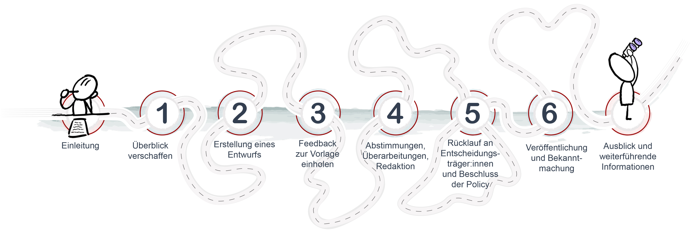
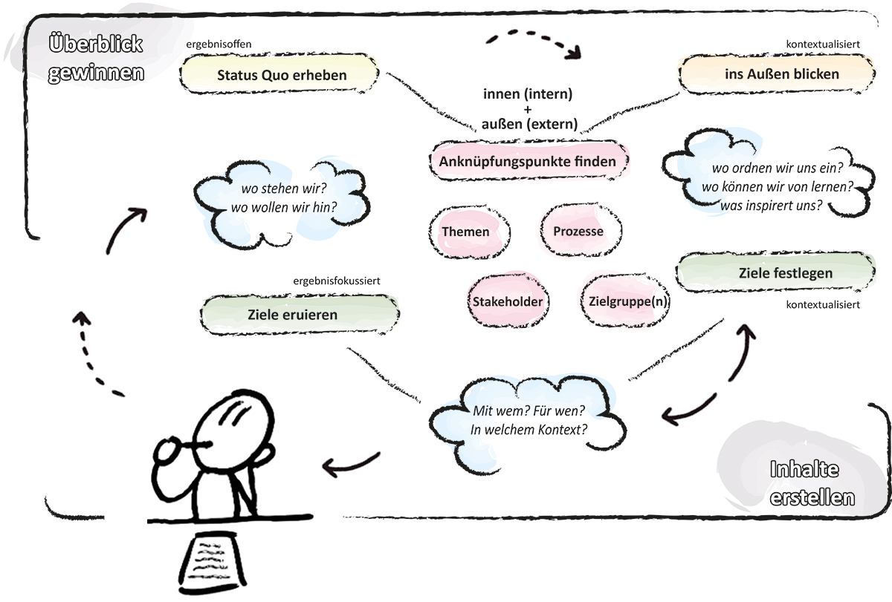
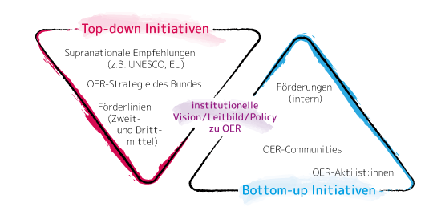
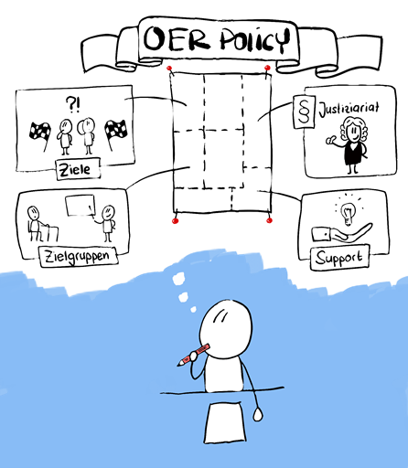
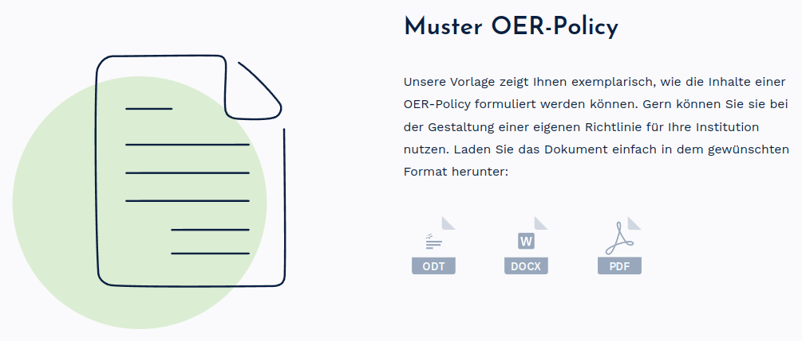
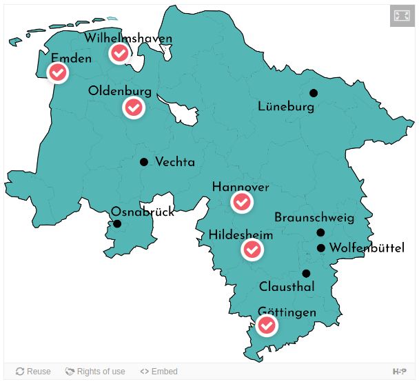
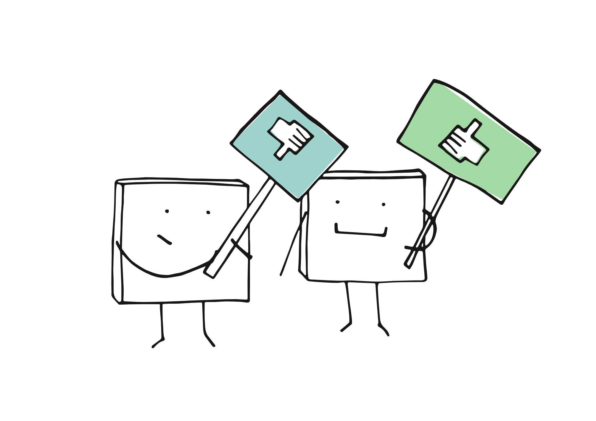
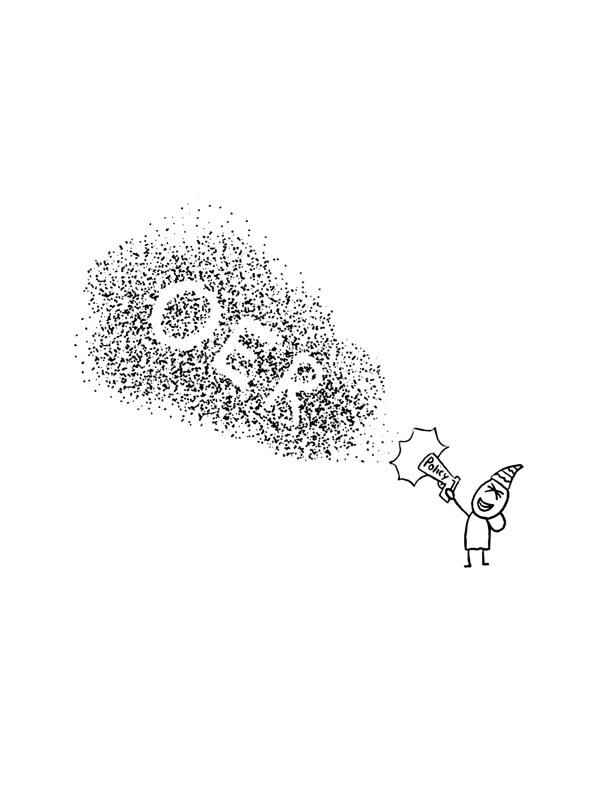

!--
author: Policy Kit Team
email: support.twillo@tib.eu
language: de
narrator: Deutsch Female
comment: OER-Policy Kit (Stand 2024) von Policy Kit Team lizenziert unter CC BY-SA 4.0 (sofern nicht anders an einzelnen Inhalten angegeben).
-->

# OER-Policy Kit

*Roadmap OER-Policy Prozess von Frank Homp und Stefanie Legler lizenziert unter [CC BY 4.0](https://creativecommons.org/licenses/by/4.0/deed.de)*

Immer mehr Hochschulen bekennen sich zu Openness und wollen durch eine Richtlinie das Signal für Lehrende und andere Hochschulangehörige setzen, dass sie das Erstellen und Teilen von OER unterstützen. Obwohl diese Richtlinie – zumeist als OER-Policy bezeichnet – nicht unbedingt rechtlich verbindlich ist, wie z.B. eine Dienstanweisung, schafft sie einen hohen Grad an **Verbindlichkeit für das Thema OER** und öffnet damit viele Türen hin zu einer anerkannten und gelebten offenen Bildung.

Der Weg zu eine OER-Policy kann je nach Hochschule sehr unterschiedlich sein. An einer kleineren Hochschule, wo die Entscheidungswege eher kurz sind, kann der Policy-Prozess relativ schnell erfolgreich sein. An einer größeren Hochschule kann der Weg zu einer OER-Policy hingegen länger dauern, schon allein weil der Beteiligtenkreis größer ist. Daneben gibt es auch viele weitere Faktoren, die den Entstehungsprozess einer OER-Policy prägen, wie z.B. das Stimmungsbild zu OER in Entscheidungskreisen oder die Vorgehensweise (top-down/bottom-up, mehr oder weniger partizipativ usw.).

Trotz unterschiedlicher Ausgangslagen gibt es Schritte, die alle Hochschulen auf dem Weg zu einer Policy machen und Fragen, die sich alle stellen, die einen entsprechenden Prozess anstoßen und begleiten:

- Wo und wie anfangen?
- Was soll die Policy enthalten?
- Was ist aus rechtlicher Sicht zu beachten?
- Welche Akteur:innen müssen einbezogen werden und wen als Erstes fragen?

Um Ihnen die Beantwortung dieser Fragen zu erleichtern sowie Sie bei Entscheidungen und Planungen möglichst gut zu unterstützen, haben wir dieses OER-Policy Kit erstellt, das als **Leitfaden zum Policy-Prozess** zu verstehen ist. Dieses Policy Kit umfasst sieben Schritte, die mögliche Stationen beschreiben und mit weiteren [Materialien](#30) ergänzt werden, wie z.B. einer Muster OER-Policy oder Mailvorlagen.

Das Policy Kit stellt keinen Gold-Standard-Weg hin zu einer OER-Policy dar, sondern soll an die spezifische Situation Ihrer Hochschule angepasst werden. Da der konkrete Ablauf sehr unterschiedlich sein kann, ist die Reihenfolge der Schritte nicht strikt einzuhalten. Im Policy-Prozess ist eine Linearität nicht unbedingt gegeben, so dass es einige Schleifen im Policy-Prozess geben kann und mehrere Schritte wiederholt werden bzw. zwischen den Schritten hin und her gesprungen wird.

Das OER-Policy Kit (Stand 2024) wurde erarbeitet von Astrid Dreyer ([HAWK Hildesheim/Holzminden/Göttingen](https://www.hawk.de/de/hochschule/organisation-und-personen/zentrale-einrichtungen/servicestelle-fuer-qualitaet-der-lehre)), Irina Hörmann, Frank Homp und Stefanie Legler ([Netzwerk ORCA.nrw](https://www.orca.nrw/lehrende/akteure/netzwerk)), Silvia Czerwinski und Yulia Loose ([twillo](https://www.twillo.de)). Die Lizenz soll wie folgt angegeben werden: [OER-Policy Kit](https://liascript.github.io/course/?https://raw.githubusercontent.com/twillo-lehre-teilen/OER-Policy-Kit/main/OER_Policy_Kit.md#1) (Stand 2024) von Policy Kit Team lizenziert unter [CC BY-SA 4.0](https://creativecommons.org/licenses/by-sa/4.0/deed.de) (sofern nicht anders an einzelnen Inhalten angegeben).

Alle Dateien zum Nachnutzen des Policy Kits finden sich in diesem [Git-Repository](https://github.com/twillo-lehre-teilen/OER-Policy-Kit).

## Schritt 1: Überblick
Wie fange ich an?
----

Die ersten Schritte in der Entwicklung einer OER-Policy sind maßgeblich und werden stark von Ihrer Ausgangssituation und Perspektive beeinflusst. Unabhängig davon, von wo Sie beginnen, stellen sich die gleichen grundlegenden Fragen, wenn auch mit unterschiedlichen Schwerpunkten und Nuancen. Wir haben diese Fragen in einer Grafik veranschaulicht und werden sie im Laufe dieses Kapitels beantworten.
 

*Überblick OER-Policy Prozess von Frank Homp und Stefanie Legler lizenziert unter [CC BY 4.0](https://creativecommons.org/licenses/by/4.0/deed.de)*

### Wo starten OER-Prozesse?
Bei der Entwicklung einer OER-Policy an Hochschulen unterscheiden wir grundsätzlich zwischen Top-Down- und Bottom-Up-Prozessen (vgl. Orr/Neumann/Muuß-Merholz, 2017)

**Top-Down-Prozesse** werden durch einen offiziellen Auftrag der Hochschulleitung initiiert und sind eng mit der strategischen Ausrichtung der Hochschule verbunden. Diese Prozesse profitieren von der Unterstützung „von oben“ und erfordern gleichzeitig eine gute Kommunikation in die Breite der Stakeholder und Zielgruppen, um diese im Geiste einer gelebten Kultur der Offenheit an ihren Bedarfen abzuholen und mit den strategischen Zielen der Hochschule in Einklang zu bringen.

**Bottom-Up-Prozesse** hingegen werden von Lehrenden oder zentralen Service-Abteilungen angestoßen. Sie zeichnen sich durch ihre Praxisnähe und Innovationskraft aus. Auch hier ist eine effektive Kommunikation nötig, um eine breite Unterstützung und Anerkennung zu finden. Insbesondere müssen einzelne Zielgruppen überzeugt werden, sich als Stakeholder zu begreifen, wie z.B. die Hochschulleitung.

lizenziert unter [CC0](https://creativecommons.org/publicdomain/zero/1.0/deed)

Die Wahl des Ansatzes hängt davon ab, wo der Prozess beginnt. Aufbauend auf beiden Definitionen kann es Mischprozesse geben – beispielsweise wenn die Initiative von einer zentralen Einrichtung direkt an die Hochschulleitung herangetragen werden kann, dort auf Zustimmung findet und fortan unter ihrem Schirm weiterentwickelt wird. Einige Vor- und Nachteile der beiden Ansätze finden Sie in der [vergleichenden Übersicht](#42).

In beiden Fällen ist eine angepasste Strategie entscheidend, um eine erfolgreiche OER-Policy zu entwickeln. Das Potenzial einer OER-Policy liegt darin, Veränderungsprozesse in Richtung Openness und einer Kultur des Teilens steuernd zu unterstützen. Bei der Entwicklung und Implementierung der Policy bedarf es ein gewisses Maß an Feingefühl, Reflexionsbereitschaft und Offenheit (vgl. Deimann/Neumann/Muuß-Merholz, 2015). Wünschenswert wäre das natürlich auch bei Ihren Adressat:innen. Die Herausforderung bei der Gestaltung einer OER-Policy liegt unabhängig davon, ob der Anstoß von Entscheidungsträger:innen kommt oder ob zunächst Überzeugungsarbeit innerhalb der Hochschule geleistet werden muss, darin, sowohl konkrete Inhalte zu definieren als auch eine breite Akzeptanz zu schaffen. Einige Argumente für eine OER-Policy finden Sie in der [Roadmap, S.12](#41).

### Was sind die Schlüsselfragen zum Start des Policy-Prozesses?
Konkrete Fragen, die sich zu Beginn eines Policy-Prozesses stellen können, sind:

- Wo steht das Thema OER in der gelebten Kultur der Hochschule?
- Ist die Haltung gegenüber OER positiv oder dominieren Ängste oder Vorbehalte?
- Welche Rolle könnte/soll die OER-Policy an der Hochschule aufgrund dieser Vorbedingungen spielen?
- Welche Auswirkungen ergeben sich daraus für die weitere Vorgehensweise?
- Welche bereits vorhandenen Policies, Leitbilder oder Strategiepapiere können als Grundlage dienen?
- Wer sind die Schlüsselpersonen, die uns im Policy-Prozess unterstützen können?
- Ist ein offizieller Auftrag für die Entwicklung einer OER-Policy erforderlich?
- Welche Rolle spielt die offizielle Legitimation im Policy-Prozess?
- Wie wird die Arbeitskultur an unserer Hochschule den Policy-Prozess beeinflussen?
- Sind Spannungen zwischen Top-down-Ansätzen und der Bottom-up-Kultur der OER-Communities zu erwarten und falls ja, wie diese überbrücken?

Notieren Sie sich Ihre Überlegungen dazu, z.B. anhand der Methode [Change Cards](#35). Diese Überlegungen sind Ihre Grundlage und können später genutzt werden, um den Policy-Prozess zu reflektieren und Wege nachzuvollziehen.

### Wie ist der Status Quo? Welche Ressourcen sind vorhanden?
Nutzen Sie Ihren ersten Überblick, um die Möglichkeiten verschiedener Anknüpfungspotenziale und relevante Aspekte zu strukturieren und sorgfältig hinsichtlich der folgenden vier Kernkategorien zu durchleuchten:

Themen
----
Betrachten Sie OER nicht isoliert, sondern als integralen Bestandteil von **Openness** (vgl. [Walkthrough: Unesco Guidelines zur Erstellung von OER Policies](#41)). Als ein Beispiel kann hier die [Universität zu Köln](https://kups.ub.uni-koeln.de/71669/1/UzK_CD_Open_scienceGrundsaetze.pdf) herangezogen werden, die OER in ein umfassendes Openness-Konzept integriert hat. An Ihrer Hochschule können sich Anknüpfungspunkte zum Thema Openness und OER im Handlungsfeld der Bibliotheken (Open Access), im Handlungsfeld von Forschung und Transfer (Open Science/Open Data) und in allen rechtlichen Schnittmengen beim Justiziariat finden lassen.

Das Thema OER ist zudem eng mit **Nachhaltigkeit** verknüpft. Sie haben verschiedene Möglichkeiten, diese Verbindung als Argument für OER und eine dementsprechende Policy zu nutzen. Falls Ihre Hochschule (noch) kein Nachhaltigkeitsleitbild hat, in dem OER unter Umständen sogar explizit erwähnt wird, finden sich Beispiele dafür zum bei der [Uni Bielefeld](https://www.uni-bielefeld.de/themen/nachhaltigkeit/nachhaltigkeitsleitbild/) (OER explizit erwähnt), der [Uni Bamberg](https://www.uni-bamberg.de/nachhaltigkeit/leitbild-nachhaltigkeit/) (basiert auf den SDGs der UNESCO), der [RWTH Aachen](https://www.rwth-aachen.de/cms/root/die-rwth/Nachhaltigkeit/~ppuld/Nachhaltigkeitsleitbild/) (Verweis auf BNE und „Offenheit der Lehre”) oder der [Uni Hamburg](https://www.uni-hamburg.de/uhh/profil/leitbild/nachhaltigkeit.html) (Bezug zu SDGs). Weitere Hochschulen mit einem veröffentlichten Nachhaltigkeitsleitbild sind die [Uni Siegen](https://www.uni-siegen.de/nachhaltigkeit/nh_leitbild_governance/?lang=de), [TU Chemnitz](https://www.tu-chemnitz.de/tu/nachhaltigkeit/nh_leitbild.html), [Uni Kassel](https://www.uni-kassel.de/uni/universitaet/profil/profil-umwelt-und-nachhaltigkeit/umwelt-und-nachhaltigkeit/nachhaltigkeitsleitbild), [FU Berlin](https://www.fu-berlin.de/sites/nachhaltigkeit/commitment/leitbild/Nachhaltigkeitsleitbild_FUB_finale_Fassung-mit-Unterschriften.pdf) und die [Uni Bonn](https://www.uni-bonn.de/de/universitaet/ueber-die-uni/nachhaltige-uni/boost-leitbild). Die wesentlichen Argumente aus offiziellen Dokumenten supranationaler Organisationen finden Sie in unserem Material [OER und Nachhaltigkeit](#43).

Die Identifikation von [Querschnittsthemen](#40) und damit von potentiellen OER-Befürworter:innen unter den Lehrenden, den akademischen Führungsebenen sowie in den diversen zentralen Hochschuleinrichtungen ist der wohl wichtigste Schritt in der Überblicks-Phase. Möglicherweise gibt es an Ihrer Hochschule bereits AGs oder Strategiegruppen, die Facetten von Openness bearbeiten.

Prozesse
-----
Untersuchen Sie vorhandene Policies, Leitbilder und Strategiepapiere Ihrer Hochschule. Verstehen Sie deren Entstehungsgeschichte im Kontext der Kultur Ihrer Institution. Berücksichtigen Sie, wie Innovationsprozesse an Ihrer Hochschule typischerweise initiiert und umgesetzt werden und ziehen Sie Parallelen zur Entwicklung einer OER-Policy: Hier ergeben sich potenzielle Unterschiede, falls es sich bei Ihrem Policy-Prozess um einen [Top-down- oder Bottom-up-Ansatz](#3) handelt.

Hilfreich ist hier ein Blick in die **Digitalisierungsstrategien** auf nationaler Ebene (z.B. [Empfehlung des Wissenschaftsrats zur Digitalisierung für Studium und Lehre](https://www.wissenschaftsrat.de/download/2022/9848-22.pdf?__blob=publicationFile&v=8)), auf Ebene der Länder (insbesondere natürlich desjenigen, in dem Ihre Hochschule verortet ist – z.B. [Nordrhein-Westfalen](https://www.wirtschaft.nrw/system/files/media/document/file/mwide-digitalstrategie2.0_final.pdf) oder [Niedersachsen](https://bildungsportal-niedersachsen.de/digitale-welt/masterplan-digitalisierung)) sowie auf institutioneller Ebene. Falls an Ihrer Hochschule schon eine Digitalisierungsstrategie vorliegt, sollten Sie nachschauen, inwieweit OER bzw. Openness bereits thematisiert werden. Möglicherweise wird ein thematisch sehr ähnliches Papier zeitgleich von einer Digitalisierungs-AG oder einem Gremium an Ihrer Hochschule entwickelt (in diesem Fall ist eine Kooperation anzustreben). Weiterhin können hochschulspezifische Leitbilder oder verschriftliche **Visions- und Positionspapiere** Hinweise darauf geben, inwiefern eine OER-Policy als Ausdruck einer Kultur gelebter Offenheit auf fruchtbaren Boden fallen könnte.

Stakeholder
-----
Im Kontext von OER-Policy-Prozessen unterscheiden wir zwischen „Stakeholder“ und „Zielgruppen“. Dabei kann es Überschneidungen zwischen beiden Gruppen geben und der Status zu Beginn identifizierter Stakeholder und Zielgruppen sich während des Policy-Prozesses ändern. Auf der nächsten Seite „Wo finde ich Verbündete?“ gehen wir detailliert auf potenzielle Zielgruppen und Stakeholder ein.

Im Folgenden sind „Stakeholder“ eine Person oder Gruppe, die ein Interesse an der Entwicklung und Umsetzung einer OER-Policy hat. Dies kann eine breite Palette von Akteur:innen umfassen, beginnend bei einer Institution, Abteilungen oder Fachbereich, verschiedenen Statusgruppen der Hochschule sowie allen Personen und Stellen, die innerhalb des OER-Prozesses involviert sind und die durch die OER-Policy beeinflusst werden oder diese beeinflussen können. Identifizieren Sie Kolleg:innen, die bereits Interesse an oder Berührungspunkte mit OER haben und binden Sie sie in Ihre Überlegungen mit ein. Hier kann es sich sowohl um intrinsisch motivierte Personen handeln, als auch um Funktionsstellen, die qua Aufgabengebiet eine wichtige Rolle im Policy-Prozess spielen – diese werden spätestens im Feedbackprozess eingebunden (s. Schritt 3 [Feedback](#16)). Analysieren Sie die Stakeholder z.B. mit Hilfe einer [Matrix](#33). Solange Stakeholder sich ihres Status nicht bewusst sind, gelten sie als Zielgruppe, die noch ins Boot geholt werden muss.

Zielgruppen
-----
Eine „Zielgruppe“ bezieht sich spezifischer auf die Gruppen oder Individuen, an die sich die OER-Policy direkt richtet oder die von ihr direkt betroffen sind. Berücksichtigen Sie die Bedürfnisse und Herausforderungen verschiedener Zielgruppen, die von der Policy betroffen sein werden. Dies können sowohl Entscheidungsträger:innen in einem Bottom-up-Prozess als auch Lehrende und andere Hochschulmitglieder in einem Top-down-Prozess sein, sowie die Studierenden und ihre institutionelle Rolle als Hochschulmitglieder. Stellen Sie sicher, dass die Policy die Bedürfnisse und Anforderungen der Zielgruppen berücksichtigt und nicht überfordernd wirkt. Eine sorgfältige Identifikation und Analyse der Zielgruppen ist daher unerlässlich. Ein Instrument hierzu, das sich in der Praxis bewährt hat, ist die Erstellung von [Personae](#38).

Dokumentieren Sie Ihre Überlegungen und reflektieren Sie diese regelmäßig, um Lücken oder Wahrnehmungsbias zu identifizieren. Ein hilfreiches Instrument kann bereits zu diesem Zeitpunkt der [Open Education Policy Canvas](#34) sein. So können Sie den Prozess in den Anfängen dahingehend unterstützen, dass er den Anforderungen Ihrer Hochschule gerecht wird und im späteren Verlauf die Akzeptanz und das Engagement aller Beteiligten fördert. Bei allen genannten Punkten empfiehlt es sich – insbesondere wenn Sie noch nicht lange an Ihrer Hochschule tätig sind – mit erfahrenen Kolleg:innen Rücksprache zu halten und diese ggf. um Beratung zu bitten.

Ungeachtet dessen, von wo Sie starten, können OER-Policies ein Spannungspotenzial bergen. Das liegt u.a. daran, dass Policies letztendlich aufgrund ihres normativen Charakters Top-down-Ansätzen zugeordnet werden. Auf der anderen Seite sind OER-Communities typischerweise eher Bottom-up organisierte Phänomene mit einer spezifischen Kultur und dementsprechenden Werten. Solche Communities durch Anweisungen zu regeln kann daher einen “clash of cultures“ provozieren. Eine umfassende Kommunikationsstrategie kann hier hilfreich sein.

Durch eine umfassende Analyse Ihrer Ausgangssituation lassen sich Ressourcen transparent offenlegen, auf denen Sie aufbauen können, um gemeinsam mit weiteren OER-Stakeholdern Ziele und Maßnahmen zu entwickeln. Die Ziele werden unter Berücksichtigung und ggf. Einbeziehung der relevanten Zielgruppen festgelegt. Wichtig ist außerdem, sowohl intern als auch extern von anderen als Mitstreiter:in gefunden zu werden. Dadurch wird das Thema OER sichtbarer und gleichzeitig Wege geebnet, das Thema zugänglicher zu machen (vgl. Schritt 6 [Veröffentlichung](#25)).

### Wo finde ich Verbündete? Wer macht mit?
Die Identifikation von OER-Befürworter:innen und anderen relevanten Stakeholdern ist ein zentrales Element im Prozess einer OER-Policy. Dies kann herausfordernd sein, besonders wenn Sie in Bezug auf OER noch nicht weitreichend vernetzt sind. Ein pragmatischer Ansatz ist es, zunächst Gespräche mit Vorgesetzten und Kolleg:innen Ihrer Abteilung zu führen, um herauszufinden, wer bereits mit OER arbeitet bzw. dem Thema positiv gegenübersteht. Gleichzeitig ist es wichtig, die Personen zu identifizieren, die bisher zwar nicht aktiv in das Thema OER involviert waren, aber aufgrund ihrer Expertise und Erfahrung wichtige Beiträge leisten könnten.

Versuchen Sie nachzuvollziehen, wie ähnliche Initiativen an Ihrer Hochschule abgelaufen sind und welche Stakeholder typischerweise beteiligt sind. Deren Position und Rolle an der Hochschule, sei es in einer Fakultät oder einer zentralen Einrichtung, kann Ihren Ansatz beim Policy-Prozess beeinflussen. Einen eher theoretischen Einstieg in die Überlegungen darüber, wen man ansprechen kann oder muss, bietet das [Whitepaper Open Educational Resources (OER) an Hochschulen in Deutschland](https://open-educational-resources.de/materialien/oer-whitepaper/oer-whitepaper-hochschule/). Bei der Lektüre stolpert man über relevante Namen aus der deutschsprachigen OER-Szene, was bei der Auseinandersetzung mit einer derart komplexen Thematik hilfreich sein kann.

Da Sie sich mit diesem OER-Policy Kit befassen, gehören Sie vermutlich einer der erwähnten Gruppen an und finden im weiteren Verlauf Informationen zu Ihren potentiellen Mitstreiter:innen. Folgende Gruppen werden hier im Besonderen erwähnt:

Hochschulleitung
----
Für eine erfolgreiche OER-Policy ist es entscheidend, die Hochschulleitung frühzeitig einzubinden, unabhängig davon, ob Sie einen Bottom-Up oder Top-Down Ansatz verfolgen. Präsentieren Sie Ihre geplante Vorgehensweise und Roadmap klar und überzeugend (Inspiration dazu finden Sie in der [Präsentation Kickoff und Roadmap](#41)). Die Kommunikation mit Entscheidungsträger:innen wie Vizepräsident:innen oder Prorektor:innen sollte sorgfältig geplant werden, um deren Verständnis und Unterstützung für die Potenziale von OER zu gewinnen. Nutzen Sie dabei anschauliche Materialien, um die Ziele und den erwarteten Impact der OER-Policy zu verdeutlichen. Inspiration finden Sie in der Präsentation Kick-Off & Roadmap der Universität Bielefeld.
Zur thematischen Vorbereitung könnte die **OER-Impact-Forschung** hilfreich sein, deren Diskurs klar auf die Notwendigkeit eines Kulturwandels verweist. Eine zusammenfassende Darstellung dazu findet sich z.B. bei Otto/Schroeder/Diekmann/Sander, 2021.

Fachbereichs-/Institutsleitungen
----
Auch Dekane und Fachbereichsleitungen können wertvolle Verbündete sein, da sie einen umfassenden Überblick über die Aktivitäten in ihren Bereichen haben und strategische Hochschulprozesse mitgestalten. Sie besitzen oft einen detaillierten Einblick in die Aktivitäten und Bedürfnisse der Lehrenden innerhalb ihrer Fakultäten oder Fachbereiche. In ihrer Rolle können sie eine Brückenfunktion zwischen der Hochschulleitung und den Servicebereichen einnehmen, was für die Integration und Förderung von OER-Projekten und -Initiativen an der Hochschule von großer Bedeutung ist.

Justiziariat
-----
Das Justiziariat nimmt eine zentrale und wertvolle Position in der Gestaltung einer OER-Policy an Hochschulen ein. Dadurch wird die rechtliche Integrität und langfristige Tragfähigkeit der Policy gesichert. Um eine Policy zu entwickeln, die nicht nur den hochschulinternen Anforderungen entspricht, sondern auch im Einklang mit gültigen Gesetzen und Richtlinien steht, ist eine Expertise im Bereich des Urheber- und Hochschulrechts unerlässlich. Die Zusammenarbeit mit dem Justiziariat ist daher für die Qualität und Durchführbarkeit einer OER-Policy unabdingbar.

Hochschulbibliothek
----
Bibliotheken sind verlässliche Infrastruktureinrichtungen und unterstützen mit der Bereitstellung von OER-Portalen und anderen Repositorien bzw. Referatorien aktiv die Etablierung von OER in allen Bildungsbereichen. Gleichzeitig wirken Bibliotheken als wichtige Bildungsanbieter:innen. Insbesondere im Bereich Open Science und Open Access ist hier eine hohe Expertise angesiedelt: Bibliotheken unterstützen die Kompetenzentwicklung von Lehrenden und Lernenden durch vielfältige Bildungs- und Beratungsangebote, die sich u.A. mit urheberrechtlichen und lizenzrechtlichen Fragen sowie Publikationsmöglichkeiten und technischen Formaten für die Bereitstellung von Ressourcen beschäftigen. Bibliothekar:innen spielen demnach eine besondere Multiplikator:innenrolle (Deimann/Neumann/Muuß-Merholz, 2015, S.48).

Für Lehrende bieten Bibliotheken Mehrwerte z.B. über die DOI-Vergabe für OER oder die Möglichkeit, aus dem eigenen Hochschulrepositorium eine Liste mit veröffentlichten Lehr-Lernmaterialien auf Personenseiten von Hochschullehrenden anzeigen zu lassen. Insbesondere die Verknüpfung eines OER mit einem persistenten Identifiers wie z.B. DOI oder Handle zahlt auf das Konto der Sichtbarkeit der Lehre und damit von OER ein (vgl. Rempis, 2023). Oftmals finden also in Hochschulbibliotheken schon Aktivitäten zur Förderung von OER statt oder werden angestrebt. Es ist daher anzunehmen, dass Sie hier Stakeholder finden werden, die Ihre Bestrebungen zur Entwicklung einer OER-Policy mittragen oder aktiv unterstützen werden.

Hochschuldidaktik und Mediendidaktik
----
Weitere Unterstützer:innen für eine OER-Policy sind vermehrt in solchen Einrichtungen anzutreffen, in denen hochschul- und mediendidaktische Fragen eine zentrale Rolle spielen, also z.B. Servicestellen für Lehre und Studium, E-Learning-Abteilungen, hochschuldidaktische Zentren, usw. Diese haben das Thema OER häufig bereits in ihr Beratungs- und Veranstaltungsangebot integriert. Einige der frei zugänglichen OER-Selbstlernkurse finden Sie in dieser Auflistung.

An einigen Hochschulen spielen OER in Verbindung mit dem genutzten LMS eine Rolle, wenn dieses etwa über eine offene Schnittstelle direkt an eine OER-Plattform angebunden ist (z.B. Verknüpfung zwischen OER Campus in Stud.IP und [twillo](https://www.twillo.de/oer/web/)) oder wenn sich Kurse im offenen LMS im [OERSI](https://oersi.org/resources/) indexieren lassen (z.B. [Ruhr-Universität Bochum](https://open.ruhr-uni-bochum.de/), [Fernuni Hagen](https://offene.fernuni-hagen.de/) oder [HHU Düsseldorf](https://mediathek.hhu.de/)). Dadurch können neben den Mitgliedern der Hochschule auch Personen von außerhalb auf die Lehr-/Lernmaterialien zugreifen.
Mancherorts werden von hochschul- und mediendidaktischen Abteilungen OER-Zertifikate vergeben, die ihren Inhaber:innen beispielsweise besondere Veröffentlichungsoptionen für OER ermöglichen. Für die Hochschule und insbesondere das Justiziariat kann es sinnvoll sein, eine Art [OER-Checkliste](https://doi.org/10.57720/2762) als obligatorischen Zwischenschritt zwischen Kurserstellung und Kursveröffentlichung zu schalten.

### Welche Gruppen werden miteinbezogen?
Lehrende
----
Lehrende sind zentrale Akteur:innen in der OER-Community an Hochschulen und spielen eine Schlüsselrolle bei der Förderung einer Kultur des Teilens. Um Lehrende, die bereits in OER-Projekte involviert sind oder eigeninitiativ OER erstellen, zu identifizieren, können bestehende oder bereits abgeschlossene OER-Projekte und -Förderlinien wie [OERcontent.nrw](https://www.dh.nrw/kooperationen/OER-Content.nrw-42) oder die [niedersächsischen Förderlinien](https://www.twillo.de/oer/web/community/) herangezogen werden. Oft sind diese Lehrenden über die Hochschule verteilt und agieren unabhängig voneinander, was ihre Identifikation herausfordernd machen kann. Hochschuldidaktische und E-Learning-Einrichtungen können hierbei unterstützen, da sie häufig mit diesen Lehrenden in Beratungen und Veranstaltungen interagieren oder [Selbstlermaterialien](#37) anbieten . Über die Identifikation von Lehrenden, die bereits eine OER-affine Lehrkultur pflegen, können evtl. auch Studierende in den OER-Prozess einbezogen und sie im Folgenden als Zielgruppe und/oder Stakeholder einer OER-Policy betrachtet werden.

Studierende
----
Die Rolle der Studierenden im Kontext von OER ist vielschichtig. Sie sind nicht nur die Hauptnutznießer:innen von qualitativ hochwertigen Lehrmaterialien, sondern können auch aktiv OER mitgestalten – was sie zu Zielgruppe bzw. Stakeholder einer OER-Policy machen kann. Ihre Einbindung in den Prozess kann dazu beitragen, eine Kultur des Teilens (vgl. Jahn/Kober/Reichardt, 2023) und der Offenheit an der Hochschule zu fördern. Erste Ansprechpersonen finden sich in den Studierendenvertretungen. Hier sollte im Kontext der Sichtbarkeit von OER (vgl. Schritt 6 [Veröffentlichung](#25)) parallel zu Policy-Prozessen über das Potenzial und die Verfügbarkeit von OER informiert werden, um das Bewusstsein auch dieser Gruppe für die Verbreitung und Nutzung von OER einzusetzen und sie zu motivieren, sich aktiv am [OER-Lebenszyklus](https://doi.org/10.5446/66288) zu beteiligen. [OER-Selbstlernmaterialien](#37) können dabei unterstützend kommuniziert werden.

Dabei ist es wichtig, für die rechtlichen Aspekte insbesondere im Hinblick auf Urheberrecht und Verwertungsrechte zu sensibilisieren. Wenn Studierende dazu ermutigt werden, ihre eigenen Lernergebnisse unter offenen Lizenzen zu teilen, sollten sie zuvor über ihre Rechte und Pflichten aufgeklärt werden. Die Studierenden dürfen keine Nachteile erfahren, wenn sie ein Werk nicht veröffentlichen wollen. Insofern sollten Sie dies möglichst früh in Ihrer Lehrveranstaltung ansprechen und ggf. Alternativen für diese Studierenden anbieten. (vgl. [OER Policy der FH Dortmund](https://www.fh-dortmund.de/medien/hochschule/gesetze-verordnungen-erlasse/14_OER-Policy-FH-Dortmund.pdf), S.4). Möchte die Hochschule selbst die Lernergebnisse Studierender offen lizenzieren, müssen die Studierenden über eine [Vereinbarung über die Übertragung von Nutzungsrechten](https://www.twillo.de/oer/web/vorlagen-und-werkzeuge/) der Hochschule diese einräumen.
Die Zusammenarbeit von Studierenden und Lehrenden bei der Erstellung von OER bietet zudem ein großes didaktisches Potenzial, dessen Publikation (zum Beispiel über die Bibliothek) und damit Sichtbarkeit von Interesse für die zentralen hochschuldidaktischen Einrichtungen (z.B. im Bereich des Peer Learning und Peer Teaching) ist.

Weitere relevante interne Akteur:innen
-----
Neben dem Suchen und Finden von OER-Befürworter:innen ist zudem das Einbeziehen weiterer Stakeholder an der Hochschule relevant, die im Laufe des Policy-Prozesses mitwirken bzw. eine wichtige Rolle spielen. Hier lohnt es sich ggf. schon ab dem ersten Entwurf, diese Schnittstellen entsprechend der [Roadmap](#41) zu informieren und miteinzubeziehen:

- AGs oder Strategiegruppen, die sich mit Digitalisierung, Lehre bzw. Hochschuldidaktik, Open Science/Open Data/Open Access, Hochschulentwicklung und verwandten Themen auseinandersetzen
- Gremien (Senat, Hochschulrat etc.)
- Gleichstellungsbeauftragte, Diversity Manager:in
- Schwerbehindertenvertretung
- Personalräte

### Was machen die Anderen? Woraus lässt sich Inspiration schöpfen?
Nutzen Sie die Erfahrungen anderer Hochschulen, externe Quellen und OER-Netzwerke, um durch diese Inspiration Ihren eigenen Policy-Prozess zu optimieren. Wenn Ihre eigene Organisationseinheit mit solchen Hochschulen verbunden ist (z.B. über Landesprojekte), die bereits eine OER-Policy veröffentlicht haben, ist eine Kontaktaufnahme voraussichtlich unproblematisch. Darüber hinaus können Vorgesetzte und Kolleg:innen dabei helfen, die gut mit Beschäftigten anderer Hochschulen vernetzt sind.

Auch bei diesem Schritt können relevante Fragen im Format der [Change Cards](#35) gestellt werden:

* Welche Erkenntnisse können wir aus existierenden OER-Policies ziehen?
* Wie können wir von externen Impulsen profitieren?
* Welche externen Kontakte und Netzwerke können uns unterstützen?

### Wie gelingt effektive Vernetzung?
Die Vernetzung ins Außen ist eine zentrale Komponente im Policy-Prozess. Dabei knüpfen Sie aktiv Kontakte knüpfen und bringen sich in bestehende Netzwerke ein. Sie können somit von den Erfahrungen anderer profitieren und sowohl für die eigene Arbeit als auch das Thema OER Sichtbarkeit (vgl. Schritt 6 [Veröffentlichung](#25)) schaffen. Konkret können Sie folgende Schritte unternehmen:

Eine Anlaufstelle bieten
----
Falls nicht schon geschehen, ist jetzt der richtige Zeitpunkt eine OER-Homepage einzurichten. Hier können Sie zunächst allgemein über das Thema OER informieren. Auf dieser Seite können Sie den Policy-Prozess und später dann auch das OER Policy-Dokument ankündigen und verlinken. Richten Sie am besten auch eine dementsprechende E-Mail Adresse ein, wie z.B. OER@ihreHochschule.de. Das könnte die Kommunikation zum Thema OER etwas offizieller machen.

Dialog mit OER-Aktiven
----
Suchen Sie den Austausch mit erfahrenen OER-Aktiven. Diese können wertvolle Einblicke in erfolgreiche Strategien und Herausforderungen bieten. [OER-Veranstaltungen](https://open-educational-resources.de/kalender/) oder Tagungen wie das OERcamp sind ein guter Ausgangspunkt, um in den Dialog zu kommen. Die [AG OER-Policy und -Governance](https://kn-oer.de/ag-oer-policy-governance/), die [Arbeitsgruppen zur OER World Map](https://open-educational-resources.de/nachbereitung-des-ersten-offenen-arbeitstreffens-zur-weiterentwicklung-der-oer-world-map-noch-bis-zum-30-11-moeglich/#more-27398) sowie die regelmäßigen [OER-Policy Netzwerktreffen](https://www.twillo.de/oer/web/veranstaltungen/) von twillo bieten Foren für den Austausch und die gemeinsame Entwicklung von OER-Policies.

Nutzung von OER-Portalen
----
Informieren Sie sich auf OER-Portalen über aktuelle Entwicklungen, Ressourcen und Best Practices. Diese Portale dienen als Wissenspool und Inspirationsquelle. Eine Übersicht zu deutschen OER-Repositorien und Referatorien bietet [OERinfo](https://open-educational-resources.de/oer-repositorien-und-referatorien-an-hochschulen/).

Einblick in OER Policy Karten
----
Für Nordrhein-Westfalen und Niedersachsen bieten die [OER-Policy Karten](#13) einen Überblick über bestehende Initiativen und Policies. Nutzen Sie diese als Orientierungshilfe. Die [OER World Map](https://www.bildungsserver.de/bisy.html?a=8678&spr=0) soll reaktiviert werden (Stand 03/24) und bietet dann eine ideale Plattform, diese Informationen zu bündeln.

### Startklar für den Policy-Entwurf?
Zusammenfassend ist entscheidend, die Ziele Ihrer OER-Policy klar zu definieren, wobei diese sowohl ergebnisorientiert sein als auch die Kultur und strategische Ausrichtung Ihrer Hochschule widerspiegeln sollten. Die Einbindung und Zusammenarbeit mit einem Kernteam aus relevanten Stakeholdern sind unerlässlich, um die Vielschichtigkeit von OER an Ihrer Hochschule abzubilden. Je nach Ansatz ([Top-Down oder Bottom-Up](#3)) kann der Start ein [Kick-off Meeting](#41) mit ausgewählten Kolleg:innen oder ein erstes Meeting mit der Hochschulleitung sein.

Die Erfassung des Status quo von OER und die Identifikation der Schlüsselpersonen sind komplexe, aber grundlegende Schritte, um ein fundiertes Verständnis für die Entwicklung Ihrer Policy zu schaffen. Diese Phase bereitet den Boden für Schritt 2, in dem wir uns der konkreten Erstellung des Policy-Entwurfs widmen. Hierbei werden die zuvor gesammelten Erkenntnisse und das Netzwerk an Unterstützer:innen genutzt, um einen effektiven und zielgerichteten Policy-Entwurf zu gestalten.

## Schritt 2: Entwurf
Wie überwinden Sie das weiße Blatt Papier?
----
Bei der Erstellung eines Entwurfs wird es konkret. Wie konkret, hängt davon ab, ob Sie sich erst noch den offiziellen Auftrag zum „weitermachen“ holen dürfen (s. Schritt 1 [Überblick](#2)) oder ob dieser bereits an Sie ergangen ist. Vielleicht haben Sie dieses Policy Kit direkt in diesem Kapitel gestartet, wollen endlich loslegen und etwas schwarz auf weiß festhalten, um es Ihren Adressat:innen vorzustellen oder den Entscheidungsträger:innen vorzulegen, damit sie das offizielle GO erhalten.

*OER-Policy Elemente von Frank Homp lizenziert unter [CC BY 4.0](https://creativecommons.org/licenses/by/4.0/deed.de)*

### Gibt es eine Blaupause? - Die twillo Muster Policy

*Screenshot Webseite [twillo](https://www.twillo.de/oer/web/oer-policy/)*

Für eine Übersicht bietet sich die [Muster Policy](https://www.twillo.de/oer/web/oer-policy/) des niedersächsischen Landesportals twillo sehr gut an. Sie ist nach dem Baukastenprinzip aufgebaut und zeigt die typischen Inhalte einer OER-Policy inkl. kleinerer Formulierungsvorschläge und einiger weiterführender Gedanken. Die Muster Policy ist also eine gute erste Anlaufstelle und besteht aus folgenden Bausteinen:

1. **Die Position der Uni in Bezug auf OER**

   - Die Präambel bildet den Anfang der Policy.
   - Die Hochschule macht ihr Verständnis von OER deutlich.
   - Welche Ziele werden damit verfolgt?
   - Welche [Zielgruppen](#5) werden angesprochen (s. Schritt 1 Überblick)?
   - Anknüpfung an bereits bestehende [Themen](#5), die mit OER in Zusammenhang stehen (s. Schritt 1 Überblick)

2. **Empfehlungen der Uni („Pflichten“ der Zielgruppe)**

   - Welche offenen Lizenzen sollen für die OER vergeben werden?
   - Wie ist bei der Namensnennung im Zuge der Lizenzvergabe vorzugehen?
   - Welche Dateiformate sollen genutzt werden?
   - Wie soll die Qualitätssicherung für die offenen Bildungsmaterialien gewährleistet werden?
   - Der Aspekt „verpflichtende vs. empfehlende Policy” wird erwähnt (s. Kapitel 3 der [Guidelines on the development of open educational resources policies](#43)).

3. **Angebote der Uni (welche Unterstützung möchte sie in Sachen OER gewährleisten)**

   - Die Lehrenden bekommen trotz § 43 UrhG die für die Erstellung von OER notwendigen Nutzungsrechte eingeräumt.
   - Nennung von Ansprechpartner:innen:
   - Wer ist an der Hochschule für OER verantwortlich, wohin kann man sich bei Unterstützungsbedarf wenden?
   - Wer bietet regelmäßige Fortbildungsangebote zu OER Grundlagen an
   - Wer hostet und betreut ein eventuelles [Onlineangebot zum Thema OER](#25), wie z.B. eine OER Homepage, eine OER-Mailadresse und etwaige Handreichungen oder [Selbstlernangebote](#37)?
   - Einige Hochschulen vergeben interne Fördermittel für Lehrprojekte und knüpfen deren Vergabe an die Auflage, dass die Ergebnisse als OER veröffentlicht werden müssen.

Diese drei Schritte lassen sich im Detail natürlich auch in einer anderen **Reihenfolge** zu Papier bringen. Bisher hat sich in vielen Policies die folgende Reihenfolge, wie sie auch in der Muster Policy vorgestellt wird, etabliert.

1. Präambel
2. Lizenzwahl
3. Nutzungsrechte
4. Namensnennung
5. Offenes Dateiformat
6. Qualitätssicherung
7. Verantwortlichkeiten
8. Schulungen zu OER

### Wo gibt es bereits verabschiedete Policies?

Eine weitere bzw. ergänzende Möglichkeit zur Muster Policy ist, dass Sie sich bereits existierende Policies anschauen und vergleichen. Für die Länder [Niedersachsen](https://www.twillo.de/oer/web/oer-policy/) und [Nordrhein-Westfalen](https://mrkwnzl.github.io/orca-nrw-karte/) wurden Karten erstellt, auf denen der Stand der jeweiligen Hochschulen in Bezug auf deren OER-Policy dargestellt wird und die jeweiligen Policies verlinkt sind. Zum Teil gelangen sie über die Karte auch an Kontaktinformationen der Personen, die mit der Entwicklung der Policy betraut sind oder waren.
<iframe style="border: 3px solid rgb(0, 43, 68)" src="https://mrkwnzl.github.io/orca-nrw-karte/netzwerk-kombiniert.html?oer_policy_default=true" height="550" width="100%"></iframe>

*[Stumme Karte Kreise Niedersachsen](https://commons.wikimedia.org/wiki/File:Stumme_Karte_Kreise_Niedersachsen.svg) von NordNordWest unter [CC BY-SA 3.0](https://creativecommons.org/licenses/by-sa/3.0/deed.en), angepasst & erweitert von [twillo](http://twillo.de/)*

Darüber hinaus gibt es noch weitere Hochschulen in Deutschland bzw. im deutschsprachigen Raum mit einer verabschiedeten OER-Policy, die wir in einer [Liste](#39) zusammengefasst haben (Stand 02/24). Außerhalb von Niedersachsen und NRW sind hier folgende deutschsprachige Hochschulen hervorzuheben:

- Open Policy der [TU Hamburg](https://www.tuhh.de/tuhh/tu-hamburg/struktur/verwaltung-und-zentrale-einrichtungen/ra-rechtsreferat/ordnungen-richtlinien/open-policy) (HH)
- OER-Policy [HS Reutlingen](https://www.reutlingen-university.de/fileadmin/University/Hochschule/Lernzentrum/OER_Policy.pdf) (BW)
- OER-Policy [TU Graz](https://www.tugraz.at/fileadmin/user_upload/tugrazInternal/Studium/Lehre/RL_OER_Policy_24112020.pdf) (A)
- OER-Policy [ZHAW](https://gpmpublic.zhaw.ch/GPMDocProdZPublic/Fuehrungsgrundlagen/Z_PY_Policy_Open_Educational_Resources.pdf) (CH)

Für den internationalen Raum wurde das als offenes Wiki angelegte [OER Policy Registry](https://wiki.creativecommons.org/index.php/OER_Policy_Registry) erstellt, welches leider am 14.08.2017 das letzte Mal gepflegt wurde. Als internationale Karte diente in der Vergangenheit die [OER World Map](https://www.bildungsserver.de/bisy.html?a=8678&spr=0), deren Relaunch mittlerweile beschlossene Sache ist.

### Gibt es Anleitungen oder Handreichungen?
Ist Ihnen das zu konkret oder zu unübersichtlich? Dann könnte Ihnen ein Blick in entsprechende Handreichungen zum Thema OER-Policy weiterhelfen. Wir stellen Ihnen im Folgenden zwei vor:

Ein etwas älteres Dokument ist das Whitepaper Open Educational Resources (OER) an Hochschulen in Deutschland (Deimann/Neumann/Muuß-Merholz, 2015). Es ist nicht direkt ein Guide bzw. eine Anleitung, aber es enthält ein Kapitel mit der Überschrift “Policy Making”. Hier wird neben den grundlegenden Funktionen einer OER-Policy in einer übersichtlichen Tabelle auf mögliche Inhalte einer Policy eingegangen. Diese Inhalte werden flankiert von Fragen, die Sie sich in Bezug auf den jeweiligen Inhalts- bzw. Themenblock stellen könnten. Auf einige der Fragen werden Sie in diesem Policy Kit auch stoßen bzw. bereits gestoßen sein. Die Tabelle basiert u.a. auf den wesentlich umfangreichen [Guidelines on the development of open educational rescources policies der UNESCO](https://unesdoc.unesco.org/ark:/48223/pf0000371129), die auf der nächsten Seite zusammengefasst werden.

| Thema | zugehörige Frage |
| ----- | ----- |
| 1. Allgemeines | Was sind die mit der Policy verbundenen (strategischen) Zielsetzungen? Auf was für einen spezifischen institutionellen Kontext trifft die Policy? Wer ist Adressat der Policy? Was sind OER? Warum und wozu wollen wir OER einsetzen? Welchen Nutzen versprechen wir uns vom Einsatz von OER? |
| 2. Urheber- und Lizenzrecht | Welche Publikationen sollten offen lizenziert werden? Welche offene Lizenz soll verwendet werden? |
| 3. Material- und Lehrplanentwicklung | Wer gestaltet wie das Curriculum? Welche Materialien sollten von wem entwickelt werden? Was für Prozesse müssen entwickelt und gesteuert werden? Welche Werkzeuge sind dafür erforderlich? |
| a) Externe Beschaffung | Zu welchem Anteil sollen proprietäre Inhalte zusätzlich zu OER erworben werden? Werden OER von externen Dienstleistern hergestellt? Wie müssen entsprechende Verträge gestaltet sein? |
| b) Dokumentenformate | Welche Dokumentenformate sollten verwendet werden, um ein Maximum an faktischer Offenheit sicherzustellen? |
| c) Qualitätssicherung  (siehe dazu Abschnitt 5.f) | Wie kann die Qualität der entwickelten OER sichergestellt werden? |
| 4. Personalverwaltung | Wie können Angestellte dazu motiviert werden, sich in die Herstellung offener Materialien einzubringen? Welche Belohnungssysteme müssen installiert werden? Wie sollten Lehrkräfte weitergebildet werden, damit Sie die notwendigen Fähigkeiten entwickeln, um sich in die Herstellung und Verwendung von OER einzubringen? Wem gehören die Inhalte, die während der Arbeitszeit hergestellt werden? Wie wird die Erstellung von OER ggf. mit dem Lehrdeputat verrechnet? |
| 5. IT Infrastruktur (siehe dazu Abschnitt 5.g) | Welche IT-Infrastruktur ist notwendig, um OER zu entwickeln, zu verwalten und zu verwenden? |
| 6. Kosten | Wie viel Geld soll für die Entwicklung von OER verwendet werden? Wo kommt dieses Geld her? Wie kann sichergestellt werden, dass auch langfristig ausreichende Mittel zur Verfügung stehen? |

*Tabelle aus [Whitepaper Open Educational Resources (OER) an Hochschulen in Deutschland](https://open-educational-resources.de/materialien/oer-whitepaper/oer-whitepaper-hochschule/) von Markus Deimann, Jan Neumann, Jöran Muuß-Merholz / [open-educational-resources.de – Transferstelle für OER](https://open-educational-resources.de) lizenziert unter [CC BY 4.0](https://creativecommons.org/licenses/by/4.0/legalcode.de)*

Ein weiteres wichtiges Kapitel des Whitepapers ist das Kapitel 5.h, welches sich der besonderen Rolle der Bibliotheken im Bereich von OER widmet. Auf diesen Stakeholder sind sie evtl. im [Schritt 1 Überblick](#6) bereits gestoßen. An dieser Stelle sei erneut auf diese Personengruppe verwiesen: Im Rahmen des Entwurfsprozesses machen Sie sich u.U. auch Gedanken darüber, welche Anreizsysteme Sie in der Policy verschriftlichen wollen oder Sie werden im Rahmen der Gespräche mit den Stakeholder darauf angesprochen. Hier können Bibliotheken ins Spiel kommen. Das Sichtbarmachen von OER z.B. durch die Vergabe von DOI oder durch die Anbindung der Bibliotheksrecherche an OER-Repositorien kann ein attraktiver Anreiz für OER Produzent:innen sowie für Nutzer:innen sein. Die Bibliotheken spielen hierbei aufgrund ihrer Expertise in puncto Repositorien und Schnittstellen eine wichtige Rolle.

### Welche Hilfestellungen bieten die UNESCO Guidelines?

Die UNESCO hat in Zusammenarbeit mit dem Commonwealth of Learning die [Guidelines on the development of open educational resources policies](https://unesdoc.unesco.org/ark:/48223/pf0000371129) veröffentlicht. Diese Guidelines sind ein sehr umfangreiches Dokument und enthält evtl. Informationen, die erst relevant werden, wenn man im Policy-Prozess vorangeschritten ist, ist also tendenziell eher nichts für Anfänger:innen. Im Rahmen dieser englischsprachigen Leitlinie werden Sie durch sieben Phasen des Entwicklungsprozesses an die Erstellung einer Policy herangeführt.

Achtung: In den Guidelines wird unter „Policy” nicht ausschließlich das Dokument verstanden, welches am Ende eines Policy-Prozesses beschlossen und veröffentlicht wird, so wie es im Rahmen dieses Kits. In den Guidelines wird eher auf eine umfassende Strategie zur Förderung des Themas OER abgezielt, wozu u.a. das schriftliche Fixieren dieser Strategien gehört.

*Map of the seven-phase policy process aus [Guidelines on the development of open educational resources policies](https://unesdoc.unesco.org/ark:/48223/pf0000371129) von UNESCO und Commonwealth of Learning lizenziert unter [CC BY-SA 3.0](http://creativecommons.org/licenses/by-sa/3.0/igo/)*

Jedes Kapitel der Guidelines beginnt mit einem Abstract und einer Liste von 3-5 (Lern-)zielen, die durch die Auseinandersetzung mit dem Kapitel angebahnt werden sollen. Jedes Kapitel endet mit ausführlichen Leitfragen (“Guiding Questions“), die die Leser:innen zu ersten Formulierungen für die OER-Policy anregen sollen. Wir haben in einem [Walkthrough](#43) alle sieben Kapitel für Sie zusammengefasst.

Wenn die Guidelines Sie zunächst erschlagen, ist das vollkommen normal! Es handelt sich um ein sehr umfangreiches Dokument, in dessen Rahmen man sich Gedanken über Aspekte oder Bereiche machen kann, die evtl. noch nicht relevant sind und es ggf. auch nie werden. Leider ist das im Vorfeld schwer zu erkennen. Wir empfehlen daher zumindest die Startseite jedes Kapitels zu lesen (Abstract und Lernziele) sowie die letzte Seite (Guiding Questions).

## Schritt 3: Feedback
Von wem hole ich mir wann wie Rückmeldung zum Entwurf ein?
----

Wurde nun ein erster Entwurf einer Policy formuliert, sollte hierauf in einen oder mehreren Schleifen Feedback von verschiedenen Akteur:innen eingeholt werden, um den Text zu schärfen und die Inhalte zu prüfen. Je nach Situation und Struktur der jeweiligen Hochschule kommt es darauf an, wer wann wie Feedback gibt.

*Pixelchen [Feedback_F-01.png](https://oer-contentbuffet.info/edu-sharing/components/render/82d6267d-2518-4e60-b382-de71eb8a9511) lizenziert unter [CC0](https://creativecommons.org/publicdomain/zero/1.0/deed)*

### Von wem wird Feedback eingeholt?

Idealerweise wird Feedback von allen [Stakeholder](#6) eingeholt, mit denen man zuvor bereits über die Entwicklung einer OER-Policy gesprochen hat. Das können bis zu einem vorzeigbaren Entwurf eine ganze Menge Menschen sein – es bietet sich also an, eine kleine Liste anzulegen mit den Personen, mit denen bereits Kommunikation zum Thema OER stattgefunden hat. Gleichzeitig ist zu überlegen, welche Akteur:innen unmittelbar mit den Inhalten der Policy verknüpft sind, z.B. das Justitiariat bezüglich der Erstellung der rechtlichen Inhalte oder die Hochschul-/Mediendidaktik bezüglich der Angebote zur Förderung von OER. Diese Personen bzw. Gruppen sollten spätestens zum Zeitpunkt des Feedbacks miteinbezogen werden. Relevante Feedbackgebende können sein:

Justitiariat
----

Jurist:innen prüfen die Formulierungen in der Policy auf ihre Rechtskonformität und Rechtsverbindlichkeit. Es wird geschaut, ob alle rechtlich relevanten Inhalte enthalten sind (z.B. sollte die Policy mit einer Präambel beginnen und die Namensnennung der Hochschule enthalten). Falls die Hochschule in der Policy signalisieren möchte, Lehrenden und Mitarbeitenden notwendige Nutzungsrechte für die offene Lizenzierung einzuräumen, muss diese Formulierung entsprechend rechtswirksam formuliert sein. Insgesamt kann das Justitiariat dazu beraten, wie die Policy formuliert sein muss, damit sie sich an die zuvor festgelegte Zielgruppe richtet, wie z.B. an alle Hochschulangehörige oder lediglich an die Mitarbeitenden und Lehrenden. Zudem kann die Frage geklärt werden, was (zwingend) in der Policy verhandelt wird und was eher in ergänzenden Dokumente oder als aktuelle Informationen auf die Webseite geregelt wird.

Bibliothek
----

Bibliotheken beschäftigen sich schon sehr lange mit Open Access, Open Data oder Open Educational Resources und haben dadurch einen großen Wissens- und Erfahrungsschatz sowie ein gutes Netzwerk (vgl. BuenodelaFuente 2012, zit. nach Deimann 2015). Bibliotheksmitarbeitende können beim Feedback zur OER-Policy folgende Perspektiven einbringen:

- Metadatenstandards
- Dokumentenformate
- Urheberrecht
- Repositorien und Schnittstellen
- Problembewusstsein

Engagierte Personen im Bereich (digitales) Lehren und Lernen
----

Lehrende und Personen, die hochschulweit durch ihr Engagement in der Lehre bekannt sind und z.B. entsprechenden Gremien/ Arbeitsgruppen/ Funktionen angehören, können aus ihrer jeweiligen Perspektive konstruktives Feedback geben. Das können z.B. Lehrende mit OER-Erfahrung, Fachbereichsleitungen, neuberufene Professor:innen, Lehrende mit langjähriger Lehrerfahrung oder Lehrende verschiedener Fachdisziplinen sein. Auch bereits etablierte Arbeitsgruppen, wie z.B. eine AG Digitalisierung sind gute Anlaufstellen. Wenn man noch nicht lange an der Hochschule ist, hilft es, erfahrene Kolleg:innen um Rat zu fragen, um keine an der jeweiligen Hochschule relevante Gruppe/ Person zu vergessen.

Zentrale Schnittstellen
----

Sobald in der Policy Maßnahmen und Ansprechpersonen genannt werden, die Einrichtungen bzw. Abteilungen an der Hochschule betreffen, muss von diesen Schnittstellen Feedback eingeholt werden. Wenn z.B. in der Policy konkrete Maßnahmen zur Förderung von OER durch spezifische Unterstützungsangebote oder Lehrförderlinien formuliert sein sollen, sollten diejenigen einbezogen werden, die diese Maßnahmen umsetzen. Relevante Schnittstellen können sein: Hochschul-/ Mediendidaktik, eLearning, Evaluation, Wissenschaftliche Weiterbildung, Qualitätsmanagement etc. Auch hier gibt es ggf. bereits etablierte Arbeitsgruppen (z.B. AG Lehrentwicklung), die konsolidiert Feedback geben können. Besonders wichtig ist dabei, gezielt nachzufragen, ob diese Schnittstellen in der Policy als „Ansprechinstitutionen“ genannt werden wollen und wenn ja, wie konkret deren Angebot benannt werden soll (z.B. Beratung, Schulungen, Materialien usw.).

Entscheidungsträger:innen
----

Je nachdem, wer die OER-Policy in Auftrag gegeben hat, ist es sinnvoll, auch diese Person(en) um Feedback zu bitten. Insbesondere Personen in höheren Positionen (wie Vizepräsident:in/ Prorektor:in oder sogar Präsident:in/ Rektor:in) bringen eine strategische und hochschulpolitische Perspektive ein.

Studierende
----

Die Gruppe der Studierenden ist etwas speziell. Zwar sind sie über die Lehre direkt von OER betroffen, dennoch sind sie nicht die ersten Adressate:innen einer OER-Policy, in der die Hochschule den Mitgliedern empfiehlt, OER zu nutzen und/oder zu erstellen. Da aber viele Policies a) Studierende als Zielgruppe benennen sowie b) als Ziel u.a. die Verbesserung studentischen Lernens aufzählen, kann es sinnvoll sein, ab einem bestimmten Punkt Studierende miteinzubeziehen. Dies kann z.B. über die Einbindung von Hilfskräften, Tutor:innen oder Studierendenvertretungen realisiert werden.

### Wann wird Feedback eingeholt?
Der Zeitpunkt des Feedbacks kann sehr variabel sein – je nachdem wie partizipativ man den Prozess gestalten möchte und wie viel Zeit zur Verfügung steht. Mindestens eine Feedbackschleife sollte nach dem Entwurf mit den relevanten Akteur:innen bzw. Stakeholder durchgeführt werden. Es können auch mehrere Feedbackschleifen durchlaufen werden, die zu unterschiedlichen Zeitpunkten mit unterschiedlichen Akteur:innen stattfinden und dadurch unterschiedliche Feedbacks eingeholt werden können. In folgenden Phasen kann das Einholen von Feedback sinnvoll sein:

- Vor dem Kickoff (z.B. von Entscheidungsträger:innen)
- Vor der ersten Redaktionsphase (z.B. von OER-Befürworter:innen)
- Nach der Redaktionsphase (z.B. von Entscheidungsträger:innen)
- Der Feinschliff (v.a. mit Justitiariat)

### Wie wird Feedback eingeholt?
Feedback einholen kann auf verschiedene Art und Weise passieren, z.B. synchron/ asynchron, persönlich/ virtuell, mündlich/ schriftlich, einzeln oder in der Gruppe etc. In jedem Fall ist es sinnvoll, den Feedbackgebenden Leitfragen mit an die Hand zu geben, damit sie wissen, worauf sie besonders achten bzw. aus welcher Perspektive sie drauf schauen sollen. Grundsätzlich kann man sich folgende Fragen stellen, bevor man Feedback zu der OER-Policy einholt:

- Welche offenen Fragen möchte ich mit dem Feedback beantworten?
- Welche Art von Feedback will ich haben? Wer kann mir das geben?
- Was müssen die Feedbackgebenden über die OER-Policy und den Feedbackprozess wissen, bevor sie konstruktives Feedback geben können (vgl. [Roadmap Uni Bielefeld](41))?
- Welche Leitfragen kann ich den Feedbackgebenden zur Orientierung mitgeben?
- Wie möchte ich das Feedback einholen? Und wie gehe ich mit dem Feedback um?
- Gibt es eine Rückkopplung an die Feedbackgebenden (s. Schritt 4 [Überarbeitung](#20))? Braucht es mehrere Feedbackschleifen?

Mit diesen Fragen kann man sich einen groben Fahrplan für die Feedbackschleifen erstellen. Welche konkrete Vorgehensweise hier empfehlenswert ist, hängt von der Kommunikationskultur der jeweiligen Hochschule ab: Wie kurz sind die Wege? Kann man Kolleg:innen und Leiter:innen anderer Abteilungen diesbezüglich direkt ansprechen oder sollte der Weg über den/die Vorgesetzte laufen? Braucht es einen offiziellen Workflow oder kann man einfach Rücksprache halten? Folgende Szenarien skizzieren beispielhaft verschiedene Feedbackprozesse, wobei diese auch kombiniert werden können:

Szenario A - Der kurze Weg
----
Wer bereits mit vielen Stakeholder zur OER-Policy persönlichen Kontakt hatte, kann den Entwurf direkt an diese schicken und um Feedback bitten – ggf. wird der Feedbackprozess zuvor kurz per Mail oder Telefon angekündigt. Daraufhin können die Feedbackgebenden schriftlich asynchron Feedback geben, welches schrittweise eingearbeitet wird oder Rückfragen und Anmerkungen werden telefonisch aufgenommen und geklärt.

Szenario B - Alle an einen Tisch holen
----
Ein eher formales Setting ist die Präsentation des Policy-Entwurfs in einer gemeinsamen Kick-off-Veranstaltung mit den beteiligten Stakeholder, die dazu eingeladen wurden (s. [Mailvorlage](32) und [Präsentationsfolien Kick-off](#41)). Im Kick-off kann nochmal deutlich gemacht werden, dass die Policy nur ein Türöffner ist, aber ein wesentlicher Schritt zur Förderung von OER an der Hochschule sein kann. Folgende Punkte können dabei auf der Agenda stehen:
- Was ist OER und warum ist das wichtig?
- Warum braucht es eine OER-Policy?
- Was steht im Entwurf?
- Wie können die Beteiligten daran teilhaben bzw. mitwirken?

Szenario C - Auf mehreren Hochzeiten tanzen
----
Soll Feedback von vielen verschiedenen Stakeholder eingeholt werden, bei denen ein gemeinsames Treffen schwierig zu organisieren ist, kann man den Entwurf mit den verschiedenen Gruppen einzeln besprechen bzw. eine Kombination aus verschiedenen Feedbackmethoden machen. Dabei können z.B. engagierte Lehrende zu einem Feedback-Treffen mündlich synchron Feedback geben, während das Feedback der relevanten Schnittstellen v.a. asynchron schriftlich eingeholt wird, da hier ggf. teaminterne Absprachen zu Maßnahmen und Unterstützungsangeboten erforderlich sind. Mit dem Justitiariat sind ggf. mehrere Feedbackschleifen - mal synchron, mal asynchron - notwendig, bis jede Formulierung durch das schrittweise Feedback geprüft und angepasst ist. Dieser Prozess ist eher aufwändig, aber ermöglicht zielgruppenspezifisches Feedback.

## Schritt 4: Überarbeitung
Wie erhält der Policy-Entwurf den letzten Schliff?
----

In diesem Schritt geht es darum, den Policy-Entwurf einem Überarbeitungsprozess zu unterziehen und für den finalen Rücklauf an Entscheidungsträger:innen vorzubereiten. Wie sich dieser Arbeitsschritt gestalten kann, hängt von den Gegebenheiten Ihrer Hochschule und der Vorgehensweise bei den vorangegangenen Schritten Ihres individuellen OER-Policy-Prozesses ab.

In jedem Fall bedeutet Überarbeitung, dass der Policy-Entwurf einen Redaktionsprozess durchläuft. Dazu gehört nicht nur, den Entwurf durch Korrektorat und Lektorat gezielt qualitativ zu verbessern. Es geht insbesondere darum, zuvor erhaltenes Feedback zum Policy-Entwurf (s. Schritt 3 [Feedback](#16)) aufzugreifen und bei der Überarbeitung zu berücksichtigen. Dazu gehört es, die Feedbackgeber:innen bei Rückfragen zu kontaktieren und mit ihnen inhaltliche Aspekte und Formulierungen zu besprechen. Eine Herausforderung dabei ist, eine Umgangsweise damit zu finden, dass nicht alle Änderungs- und Ergänzungsvorschläge der Feedbackgeber:innen umgesetzt werden können.

Es kann in dieser Phase erforderlich sein, relevante [Schnittstellen an der Hochschule](#7), die bei der Entwicklung von Richtlinien miteinbezogen werden müssen und bisher noch nicht in den Policy-Entwicklungsprozess involviert waren, „mit ins Boot zu holen“ und den Policy-Entwurf mit ihnen abzustimmen. Welche Schnittstellen dabei unabdingbar sind, kann von Hochschule zu Hochschule unterschiedlich sein (s. Schritt 1 Überblick). Es kann sein, dass Sie im Laufe des Feedbackprozesses schon auf Personen hingewiesen wurden, die Sie noch in die Policy-Aktivitäten einbinden müssten. Orientieren Sie sich ansonsten, soweit möglich, an vorangegangenen Prozessen, die eine Ähnlichkeit zu Policy-Entwicklung aufweisen, z.B. die Erarbeitung einer Open-Access-Policy oder einer Digitalisierungsstrategie. Erkundigen Sie sich, wie diese Prozesse abgelaufen sind und welche Schnittstellen an Ihrer Hochschule üblicherweise an solchen Abläufen beteiligt sein müssen. Dabei kann es sich insbesondere um Verantwortliche für Datenschutz (Datenschutzbeauftragte, Datenschutzmanagement) und Hochschulgremien, in erster Linie den Senat der Hochschule und für das Thema relevante Senatskommissionen (wie z.B. eine Zentrale Studienkommission oder eine andere Kommission für Lehre und Studium), handeln. Je nach Organisationsstruktur der Hochschule kommen auch Mitarbeitendenvertretungen wie der Personalrat und die Schwerbehindertenvertretung in Frage.

Des Weiteren kann zum Schritt „Überarbeitung“ auch gehören, den Policy-Entwurf mit Vertreter:innen der Entscheidungsebene der Hochschule, üblicherweise sind dies Prorektor:innen oder Vizepräsident:innen für Studium und Lehre, zu besprechen. Dies ist in besonderem Maße relevant, wenn zu Anfang des Policy-Prozesses kein offizieller Auftrag der Entscheidungsebene stand, eine OER-Policy zu entwickeln, oder wenn dieser Auftrag wenig konkret war. Hier kann man nun die Weichen stellen, um den nächsten Schritt, den Rücklauf an die Entscheidungsebene (s. Schritt 5 [Beschluss](#24)), vorzubereiten. So werden die Chancen erhöht, dass der Policy-Entwurf bei den Entscheidungsträger:innnen tatsächlich auf Akzeptanz stößt, dort Fürsprecher:innen findet und es letztlich zum Beschluss der OER-Policy kommt.

### Bedarf es weiterer Überzeugungsarbeit und Abstimmungsprozesse?

Evtl. ist es in dieser Phase des Policy-Prozesses erforderlich, die erwähnten Schnittstellen oder die Entscheidungsebene noch (weiter) von der Relevanz einer Policy (und damit möglicherweise auch von OER) zu überzeugen - Argumente hierfür finden Sie in der [Roadmap, S.12](#41). Hierfür und um den bisherigen Policy-Entwurf vorzustellen und sich darüber weiter abzustimmen, kann es hilfreich sein, speziell auf diese Zwecke zugeschnittenes Informationsmaterial zu entwickeln. Als Methode bietet sich dafür besonders eine Präsentation an. Diese sollte so gestaltet sein, dass die Zielgruppe diese eigenständig nutzen und sich schnell „durchklicken” kann, um einen Überblick zu bekommen. Die Präsentation kann auch (z.B. über die entsprechende Funktion bei PowerPoint) als vertontes Video vorgelegt werden, das sich die Beteiligten anschauen können.

Egal in welcher Form das Informationsmaterial vorgelegt oder vorgestellt wird: Die knappen Zeitressourcen der Zielgruppe sollten berücksichtigt werden. Die Vermittlung der Inhalte sollte daher i.d.R. nicht mehr als fünf Minuten in Anspruch nehmen. Daher sollte dieses Material sehr kompakt sein und nur die wesentlichen Aspekte angesprochen werden:

- Beweggründe für eine OER-Policy: Warum braucht eine / gerade unsere Hochschule eine Policy? Welche Vorteile ergeben sich für jede:n einzelne:n Hochschulangehörige:n?
- Hintergrundinformationen zu OER (wenn die Zielgruppe bisher nur ungenaue oder gar keine Vorstellung von OER hat): Was sind OER? Wie erkenne ich OER? Wie muss ich sie kennzeichnen?
- Ggf. inhaltliche Skizze des Policy-Entwurfs: Worum geht es in der Policy? Wie empfehlend/direktiv ist sie formuliert? Welche zukünftigen Ansprechpersonen werden genannt?
- Ggf. bisherige und weitere Schritte im OER-Policy-Prozess: Was passiert nach der Überarbeitung? Was geschieht nach einem möglichen Beschluss der Policy? Wo soll sie veröffentlicht werden? Wie würde die Umsetzung der Policy vorangetrieben werden?

### Wie gestaltet sich der konkrete Überarbeitungsprozess?

Bevor man mit der Überarbeitung beginnen kann, ist zunächst zu klären, wer an diesem Schritt in welcher Form beteiligt sein soll. Wenn Sie selbst den Policy-Prozess bisher gestaltet und vorangetrieben, den Policy-Entwurf verfasst und Feedback eingeholt haben, werden Sie sich auch als redaktionell verantwortlich betrachten. Es sollte aber möglichst mehrere Überarbeitungsdurchgänge mit unterschiedlichen Perspektiven auf den Text geben, bei denen die Feedbackgeber:innen und auch weitere Personen herangezogen werden.

Empfehlenswert ist, sich zunächst mit dem Feedback zu beschäftigen, das es im vorangegangenen Schritt (s. Schritt 4 [Feedback](#16)) zum Policy-Entwurf gegeben hat. Schauen Sie sich alle Rückmeldungen an, die Sie erhalten haben, an und treten Sie in den Dialog mit den Feedbackgeber:innen:

- Ist etwas nicht verständlich oder haben Sie Rückfragen? Kontaktieren Sie die Feedbackgeber:innen und tauschen Sie sich mit ihnen über Inhalte und Formulierungen aus. Fragen Sie gezielt nach Begründungen für bestimmte Änderungen und Ergänzungen.
- Können Feedbackwünsche nicht vollständig übernommen werden, aber eventuell in abgewandelter Form? Stimmen Sie sich mit den Feedbackgeber:innen ab, legen Sie Ihre Position dar und versuchen Sie, Kompromisslösungen zu erarbeiten.
- Lassen sich Vorschläge in der OER-Policy nicht berücksichtigen? Hier ist Transparenz besonders wichtig. Machen Sie den Feedbackgeber:innen gegenüber deutlich, dass Sie sich mit den jeweiligen Rückmeldungen auseinandergesetzt haben. Erläutern Sie, warum die entsprechenden Änderungen oder Ergänzungen von Ihnen nicht übernommen werden können. Dies kann darin begründet sein, dass Aspekte an Ihrer Hochschule nicht umsetzbar sind oder als Teil einer OER-Policy erfahrungsgemäß nicht sinnvoll erscheinen. Möglicherweise handelt es sich auch um Details, die im Rahmen einer derart allgemeinen Richtlinie nicht festgehalten werden können, sondern eher in gesonderten, ggf. hochschulinternen Dokumenten.

Grundsätzlich sollten Sie sich bewusst machen, dass Sie selbst über OER-(Policy-)Expertise verfügen und als Feedbacknehmer:in die Freiheit haben, auszuwählen, welche Rückmeldungen bei der Überarbeitung des Policy-Entwurfs tatsächlich von Nutzen sind und umgesetzt werden. Gleichzeitig sollten Sie die Expertise der Feedbackgeber:innen wertschätzen und alle Änderungs- oder Ergänzungsvorschläge sorgfältig prüfen. Sie sollten auch allen Feedbackgeber:innen gegenüber Ihre Dankbarkeit dafür zum Ausdruck bringen, dass diese ihr Wissen, ihre Arbeitskraft und ihre Perspektiven in den Policy-Prozess einbringen und diese dadurch unterstützen.

Nach der Auseinandersetzung mit dem Feedback und der Einarbeitung von Rückmeldungen bzw. Änderungen infolge des Austausches mit den Feedbackgeber:innen ist als weiterer Überarbeitungsdurchgang ein Lektorat zu empfehlen. Hier ist es ratsam, eine bisher am Prozess unbeteiligte Person um ihre Mithilfe zu bitten, die bereits über Lektoratserfahrungen verfügt, sodass eine qualitative Verbesserung des Textes zu erwarten ist. Da es beim Lektorat neben dem Korrektorat sowohl zu stilistischen als auch zu inhaltlichen Überarbeitungen kommt, ist abzuwägen, ob der:die Lektor:in selbst OER-(Policy-)Expertise haben sollte. Einerseits mag dies ein Vorteil bei der Überarbeitung sein, andererseits geht es darum, dass die OER-Policy am Ende allgemeinverständlich und in sich stimmig sein soll, sodass der Blick aus Laienperspektive vielleicht noch inhaltliche Schwächen oder Lücken offenbart.

Je nach Kapazitäten sind auch verschiedene Lektoratsdurchgänge denkbar, bei denen sowohl aus Expert:innenperspektive (z.B. OER-Praktiker:innen, Mitarbeitende der Hochschul- und Mediendidaktik und Jurist:innen mit entsprechenden Vorkenntnissen) als auch aus der Sicht von OER-Neulingen (z.B. Lehrende und Studierende ohne OER-Erfahrungen) auf das Dokument geschaut wird. Bei mehreren Lektoratsdurchgängen ist eine sorgfältige Koordination wichtig: Wer bearbeitet in welcher Reihenfolge das Dokument oder parallel verschiedene Fassungen des Textes? Wie werden verschiedene Lektoratsdurchgänge zusammengeführt? Gibt es ein „Schlusslektorat”?

In jedem Fall sollten Sie sich den Text nach dem Lektorat noch einmal genau ansehen, um sicherzustellen, dass es zu keinen Änderungen gekommen ist, bei denen es sich aus Ihrer Sicht nicht um Verbesserungen, sondern um inhaltliche Verfälschungen oder inkorrektes Vokabular handelt, die eine Berichtigung erforderlich machen.

Ist die Zeit knapp und reicht nicht für ein Lektorat, sollte zumindest ein Korrektorat durchgeführt werden, bei der eine entsprechend kundige Person Rechtschreibung, Grammatik und Zeichensetzung sowie die Einheitlichkeit von Schreibweisen (Fachbegriffe, Namen, Abkürzungen, Zahlen etc.) überprüft.

### Mit welchen Tools wird gearbeitet?

Hinsichtlich der Tools für die Überarbeitung ist es ratsam, an die bisher für den Entwurf der Policy und das Einholen von Feedback verwendeten Instrumente anzuknüpfen. Auch hier sind die Gegebenheiten Ihrer Hochschule zu berücksichtigen:

- Ist es übliche Arbeitspraxis, Dokumente per Mail hin- und herzuschicken?
- Wird mit Hilfe von Google Docs oder Open Documents und/oder im Rahmen einer Hochschulcloud (z.B. Nextcloud, Sciebo) oder der Academic Cloud gearbeitet?
- Werden Wikis oder Etherpads genutzt, um Texte kollaborativ zu erstellen?

Sie sollten auf die Tools zurückgreifen, mit denen die am Überarbeitungsprozess beteiligten Personen bereits vertraut sind, sodass man sich nicht noch in ein neues Tool einarbeiten muss und die ganze Konzentration auf den Policy-Text richten kann.

## Schritt 5: Beschluss
Was sind die letzten Schritte bis zum Beschluss?
----

Nachdem Sie das Policydokument in eine Form gebracht haben, die „beschlussfähig” ist, gibt es zwei Möglichkeiten. Entweder wird ab jetzt für Sie übernommen: Sie reichen lediglich die Policy und ggf. einen kurzen Bericht zu Ihrem Vorgehen ein, der dann zum finalen Entscheid übergeben wird. Oder Sie stellen die Policy noch einmal in einem letzten Entscheidungs-Gremium vor und fassen den bisherigen Verlauf des Entwicklungsprozesses zusammen.

*lizenziert unter [CC0](https://creativecommons.org/publicdomain/zero/1.0/deed)*

Es empfiehlt sich, dass Sie sich im gesamten Prozess Notizen dazu machen, wie ihr Weg verläuft und diesen gut dokumentieren: Ihre persönliche Roadmap. Hierzu gehören auch ein paar Zahlen, z.B. wie viele Personen am Kick-off teilgenommen haben (s. Schritt 3 [Feedback](#16)) oder genau festzuhalten, mit wem Sie, worüber im Austausch waren. Mit diesen Daten können die Entscheidungsträger:innen einen Eindruck davon bekommen, welche Wellen Sie mit Ihrem Thema an der Hochschule bereits geschlagen haben.

Auch wenn diese finale Runde lediglich formal stattfindet, kann es sein, dass kritische und grundlegende Nachfragen hinsichtlich der Policy oder auch zu OER im Allgemeinen gestellt werden. Lassen Sie sich davon nicht entmutigen und seien Sie argumentativ vorbereitet (s. [Roadmap S.12](#41)). Insbesondere auf den höheren Entscheidungsebenen treffen Sie auf Personen, die mit übergeordneten und hochschulstrategischen Entscheidungen betraut sind. Hier kommt es darauf an, welchen Stellenwert OER an ihrer Hochschule oder auf Landesebene hat und inwieweit sich Ihre Adressat:innen in der Thematik auskennen. Andererseits sind wahrscheinlich auch solche Personen anwesend, die mit OER und Open Science vertraut sind oder sogar selbst Verfechter:innen sind. Mit diesen Personen sind Sie sicherlich vorher im Austausch gewesen und können Sie nun als Verbündete nutzen.

Zu diesem Zeitpunkt haben Sie i.d.R. bereits einen offiziellen Auftrag zur Entwicklung einer OER-Policy erhalten (s. Schritt 1 [Überblick](#3)), auf den Sie verweisen können. Es ist hilfreich, dass Sie den genauen Begriff dieses „Beschlusses” (z.B. Rektoratsbeschluss oder Präsidiumsbeschluss) und das Datum benennen können und idealerweise auch, wo dieser Beschluss nachzuschlagen ist. Je nachdem, wie oft Sie solche Prozesse schon begleitet bzw. durchgeführt haben, sind Sie mit den hochschulpolitischen Begriffen bereits vertraut. Sie machen damit deutlich, dass Sie die „Sprache” dieser Art von Entscheidungsprozessen sprechen und verstehen.

Neben dem bisherigen Verlauf des Policy-Prozesses ist es wichtig, die weiteren Schritte aufzuzeigen bzw. den anderen Anwesenden Raum für deren Ansichten zu geben. Dies können sein:

- Weitere Vorschläge, wo die Policy und der Prozess noch vorgestellt werden soll
- Weitere Ideen oder Anmerkungen in Bezug auf das Thema OER – Das können interessante und wichtige Anknüpfungspunkte sein, an denen Sie nach der Veröffentlichung weiterarbeiten können (s. Schritt 1 [Überblick](#2)).

Je nachdem wie verbindlich diese „Vorschläge” sind, haben Sie danach weitere Schritte auf Ihrer Roadmap und müssen ggf. noch eine Schleife drehen. In jedem Fall ist es ratsam, die Vorschläge aus diesem Gremium zu berücksichtigen. Wir gehen aber an dieser Stelle davon aus, dass nun die OER-Policy endgültig beschlossen wird.

## Schritt 6: Veröffentlichung
Wie mache ich auf die Policy aufmerksam?
----

Sobald Sie den Beschluss des Präsidiums bzw. des Rektorats in der Tasche haben, ist es nur noch ein kurzer Weg bis zur Veröffentlichung der OER-Policy. Es empfiehlt sich, nur eine einzige Stelle auf den Webseiten der Hochschule zur Veröffentlichung zu wählen, worauf dann von verschiedenen weiteren Stellen verlinkt werden kann. Neben der Veröffentlichung auf der Webseite können begleitende Kommunikations- und Marketingmaßnahmen durchgeführt sowie erklärende Informationsmaterialien zur Policy zur Verfügung gestellt werden.

Um sich einen systematischen Überblick über alle Kommunikationsmaßnahmen und -materialien zu verschaffen, ist es ratsam, ein Marketing-/ Kommunikationskonzept für die Policy zu entwickeln. In diesem Konzept wird festgehalten, über welchen Kanal welche Info von wem an wen kommuniziert wird und was es dafür braucht. So kann sichergestellt werden, dass niemand vergessen wird und alle Zielgruppen die Information zur OER-Policy zielgruppengerecht erhalten. Ggf. sollte hier Rücksprache mit der Hochschulkommunikation gehalten bzw. Feedback eingeholt werden. Folgende Fragen können dabei relevant sein:

Wo wird die Policy zentral veröffentlicht?
----
Klären Sie z.B. mit der Hochschulkommunikation oder mit dem Justitiariat, wo die Policy zentral veröffentlicht wird. Das kann z.B. auf der Hochschul-Webseite z.B. in der Rubrik „Amtliche Bekanntmachungen“ oder „Zentrale Ordnungen, Rechtsgrundlagen“ sein.

Gibt es eine eigene Informationsseite rund um OER an der Hochschule?
---
Spätestens jetzt, wo sich die Hochschule in Form einer Policy offiziell zu OER bekennt und die Förderung von OER befürwortet, ist eine eigene Informationsseite rund um OER als Anlaufstelle sinnvoll. Das kann eine separate OER-Webseite oder ein gesonderter Bereich innerhalb des Webauftritts einer Abteilung sein, die sich mit OER beschäftigt. Auf dieser Seite sollten Kontaktinformationen zu Ansprechpersonen inkl. E-Mail-Adresse (z.B. OER@Hochschule.de) genannt sein. Daneben kann auch auf weitere Dokumente oder Handreichungen verwiesen werden (z.B. eine [Checkliste OER](https://open-educational-resources.de/oer_materialien/open-educational-resources-erstellen-checkliste/) oder ein [OER Glossar](https://www.edulabs.uni-koeln.de/goto.php?target=cat_2043)). Es gibt mittlerweile eine Vielzahl an [OER-Selbstlernmaterialien](#37), durch die man sich eigenständig grundlegende Kenntnisse zum Thema OER (und angrenzende Themen) aneignen kann. Einige Hochschulen arbeiten mit festen OER-Sprechstunden, während andere auf Anfrage beraten. Eine gute Lösung hat z.B. die Hochschule Bielefeld (HSBI) gefunden, die Ihre [OER Homepage](https://www.hsbi.de/learningservices/lehrende/oer) sehr schlicht gestaltet hat. Von dort wird auf den OER-Wissenspool (ein Ilias-Kurs) verwiesen, in dem ausführlich über das Thema informiert wird.

An welchen Stellen kann auf die Policy verwiesen bzw. darüber informiert werden?
----
Sobald die Policy zentral veröffentlicht wurde, kann an relevanten Stellen darauf verlinkt bzw. verwiesen werden. Das kann auf der OER-Informationsseite sein, auf den Seiten der Bibliothek, in offenen Moodle-Kursen für Lehrende etc. Gleichzeitig kann die Nachricht über die Veröffentlichung der Policy per Push-Prinzip an die Zielgruppen herangetragen werden, indem z.B. im hochschulweiten Newsletter darüber informiert oder eine Rundmail an alle Hochschulangehörige (z.B. vom Präsidium bzw. Rektorat) verschickt wird.

Welche Begleitmaßnahmen können zur Sichtbarkeit der Policy beitragen?
----
Neben der schriftlichen Information können weitere Begleitmaßnahmen angeboten werden. Es kann z.B. eine Informationsveranstaltung zur Policy stattfinden oder in bestehende Veranstaltungen integriert werden (z.B. auf einem Tag der Lehre). Empfehlenswert sind zudem ergänzende Informationsmaterialien zur Erläuterung z.B. mit der Beantwortung der Fragen „Was heißt OER?“ oder „Warum braucht die Hochschule eine OER-Policy?“ (s. [Flyer OER-FAQ](#31)). Dadurch kann die Akzeptanz der Policy erhöht werden. Nicht zuletzt können alle beteiligten Akteur:innen, die am Entwicklungsprozess in irgendeiner Form mitgewirkt haben, als Multiplikator:innen der Policy dienen.

Wie kann außerhalb der Hochschule die Policy sichtbar gemacht werden?
----
Es lohnt sich einen Blick nach Außen zu werfen und zu überlegen, an welchen Stellen außerhalb der eigenen Hochschule die Information zur OER-Policy platziert werden kann, z.B. kann die Policy in der OER-Policy-Map von twillo oder ORCA.nrw verlinkt werden (s. Schritt 2 Entwurf). Schließlich kann auf diversen Konferenzen und Workshops darüber informiert werden, dass Ihre Hochschule jetzt eine OER-Policy hat - denn: “Tu Gutes und sprich darüber!”

## Schritt 7: Ausblick
Und jetzt? Wie geht es weiter?
----

Sie haben es geschafft! Ihre Policy wurde veröffentlicht. Und jetzt…? Jetzt geht's erst richtig los! Denn die OER-Policy soll kein ‚totes‘ Dokument sein, das auf einer Webseite verstaubt und irgendwann niemanden mehr interessiert. Ein erster Meilenstein hin zu offener Lehre ist mit der Policy als rechtliche Grundlage und Commitment geschafft. Es ist wie eine Tür, die Sie geholfen haben zu öffnen. Hindurchgehen muss man jedoch selbst. Und Sie können dabei unterstützen.

*Ausblick von Frank Homp lizenziert unter [CC BY 4.0](https://creativecommons.org/licenses/by/4.0/deed.de)*

### Wie kann die OER-Policy zum Leben erweckt werden?

Damit die Policy mit Leben gefüllt, über sie gesprochen wird und darauf aufbauend weitere Maßnahmen folgen, braucht es weitere Schritte.

**Einerseits…**

fängt man jetzt wieder ein bisschen von vorn an. Denn das Thema OER ist nach wie vor an deutschen Hochschulen nicht etabliert. Die Potenziale von OER bzw. die Lösungen, die OER anbieten kann, liegen nicht unbedingt auf der Hand. Bisher gibt es noch wenig Forschung dazu, welche Effekte vom Einsatz von OER z.B. für das pädagogische Handeln und etablierte Bildungspraktiken zu erwarten sind (Otto/Schroeder/Diekmann/Sander, 2021). Zwar findet man in vielen offiziellen Dokumenten Aussagen dazu, welche Potenziale mit OER verbunden werden, die dort aufgeführten Ziele sind aber oftmals idealistisch und kein adäquater Anreiz für Open Educational Practice (OEP) (Ladwig, 2022, S.17). In einer Policy können konkrete Ziele formuliert sein, die sich mit den Bedürfnissen Ihrer Zielgruppe decken oder sogar von dieser Zielgruppe selbst formuliert wurden.

**Andererseits…**

können Sie genau hier weiter arbeiten und das Policydokument als Türöffner für weitere Aktivitäten nutzen. Im ersten Schritt könnten Sie prüfen, inwiefern Sie die in der Policy formulierten Ziele erreichen. Unter Umständen haben Sie diesen Aspekt, die Selbstverpflichtung zur Überprüfung der Erreichung der Ziele, bereits in der Policy verschriftlicht, wie z.B. im Fall der Policy der TU Graz geschehen. Ist dies nicht der Fall, können Sie wieder in die Kommunikation mit den dementsprechenden Stakeholdern gehen, wie die selbstgesteckten Ziele zu monitoren sind. Ist dies geschehen, entwickeln Sie konkrete Maßnahmen bzw. setzen die in der Policy formulierten Maßnahmen um und evaluieren sie. Beispielsweise wurde in der Policy angekündigt, dass OER in internen Lehrförderlinien verankert wird oder dass die Veröffentlichung von OER bei der Vergabe von Lehrpreisen oder Leistungsprämien berücksichtigt wird.

### Wie nutze ich mein Netzwerk?
Innerhalb des Policy-Prozesses haben Sie viele nützliche Kontakte geknüpft und ein Gespür dafür bekommen, welche Personen Ihre lokale OER-Community bilden. Gemeinsam können Sie weitere Arbeitspakete identifizieren, um das Thema OER an der Hochschule voranzubringen. Im Rahmen der Feedbackgespräche kamen evtl. Aspekte auf, die zwar relevant für das Thema OER sind, aber nicht Inhalt der OER Policy waren. Beispielsweise könnte mit dem eLearning Service vereinbart werden, wie Qualifizierungsangebote nun an der OER-Policy ausgerichtet werden. In den Beratungen der Medien- und Hochschuldidaktik könnte die Policy z.B. als Argumentationsgrundlage für Gespräche mit Lehrenden genutzt werden, um Hürden abzubauen und Potenziale von OER aufzuzeigen.

Mit dem eLearning Service sowie der IT-Abteilung könnte eruiert werden, ob es für Ihre Hochschule möglich, ein offenes Lern-Management-System (LMS), z.B. Moodle oder ILIAS zu etablieren. Über die so zugänglichen Lehr-/Lernmaterialien könnten Studieninteressierte einen Einblick in die Lehre an der Hochschule bekommen und im Sinne eines Selfassessments ihre Kenntnisse und Eignung in Bezug auf ein bestimmtes Fach bzw. Studiengang überprüfen. Damit könnte die Hochschule für sich werben und evtl. den rückläufigen Studienanfänger:innenzahlen entgegenwirken. Die zentrale Studienberatung wäre an dieser Stelle sicherlich ein guter Gesprächspartner, um die Probleme und Bedarfe der Studierenden zu identifizieren. Ein offenes LMS (wie z.B. an der Ruhr-Universität Bochum oder der Universität Bielefeld) bedarf sowohl der technischen Wartung als auch des urheberrechtlichen Supports hinsichtlich OER, wodurch die Hochschulbibliothek ins Spiel kommt.

Mit der Hochschulbibliothek könnte außerdem über das Einspielen der Metadaten in das Bibliotheksrecherche-System gesprochen werden. In NRW hat sich eine [AG gegründet](https://pad.gwdg.de/s/orca-und-bibliotheken#ORCAOERSI-und-bibliothekarische-Rechercheangebote), die die Möglichkeiten auslotet, sowohl offene LMS als auch Bibliotheksrecherchen an den [OERSI](https://oersi.org/resources/) anzubinden. Das könnte für Sie und Ihre Hochschule auf drei Arten interessant sein.

1. Die Lehrenden werden mit ihren OER aus dem offenen hochschuleigenem LMS im OERSI gelistet und sind darüber in vielen OER-Landesportalen auffindbar.
2. Der OERSI lässt sich über eine Schnittstelle in Bibliotheksrecherche-Systeme einbinden. Wenn Studierende z.B. zur Vorbereitung auf ihre Prüfungen über das hochschuleigene Bibliothekssystem nach Literatur suchen, finden sie dadurch auch offene Lehr-/Lernmaterialien passend zu ihrem Thema.
3. Wenn die Studierenden über einen so angereicherten Recherchepool auch Lehr-/Lernmaterialien anderer Hochschulen finden, könnte dies zu Kritik führen. De Facto recherchieren Studierende bereits über andere Kanäle als nur die hochschuleigenen Angebote. Es könnte ja ein geeigneter Anreiz sein, die OER Produktion quantitativ und qualitativ anzukurbeln, damit die Studierenden eine höhere Anzahl von Lehr-/Lernmaterialien der eigenen Hochschule finden können. Hinsichtlich der Zielgruppe Studierende kommt hier auch die zentrale

Wenn man einmal vom großen Ganzen träumen möchte, könnte man die OER-Policy auch als Argumentationsgrundlage für die Entwicklung weiterer Policies nutzen, wie z.B. zu Open Access, Open Data oder Open Science (wenn an Ihrer Hochschule noch nicht vorhanden). Vorstellbar wäre auch eine allumfassende gemeinsame Policy, die die verschiedenen Bereiche von Openness in sich vereint (wie z.B. die Open Science Policy der Ruhr-Universität Bochum).

Das alles sind mögliche Ansatzpunkte, die Sie jetzt weiter verfolgen können. Die OER Community wird sich in den nächsten Jahren noch stark weiterentwickeln. Ein Kernwert von OER und damit auch eine Ihrer Kompetenzen ist Offenheit und der inhärente Vernetzungscharakter. Nutzen Sie also das Wissen und die Kompetenz der vielen, die sich, wie Sie, der Kultur des Teilens und den Open Educational Resources verschrieben haben.

### Haben Sie Anregungen?
An dieser Stelle endet das OER-Policy Kit und wir hoffen, es konnte Ihnen in Ihrem individuellen Policy-Prozess weiterhelfen. Für Anregungen, Fragen und Feedback sind wir sehr dankbar. Diese können Sie uns über [GitHub](https://github.com/twillo-lehre-teilen/OER-Policy-Kit) via Mail an `support.twillo@tib.eu` mitteilen. 

Falls Sie weitere hilfreiche Materialien rund um das Thema OER-Policy haben oder Ihre Hochschule eine OER-Policy veröffentlicht hat, die wir noch nicht in der Liste aufgenommen haben, melden Sie sich auch gerne.

*Pixelchen [Ressource_Offene Werkstatt_F-01.png](https://oer-contentbuffet.info/edu-sharing/components/render/0cde07ff-83f5-4882-b765-86c52ccf5644) lizenziert unter [CC0](https://creativecommons.org/publicdomain/zero/1.0/deed)*

## Materialien
Auf den folgenden Seiten finden Sie verschiedene Materialien zur Nachnutzung in Ihrem Policy-Prozess. Manche Dateien können Sie zur leichteren Weiterverarbeitung in einen offenen Dateiformat wie z.B. odt, docx oder pptx herunterladen.

Falls Sie ähnliche Materialien erstellt oder verwendet haben, die für andere hilfreich sein könnten, melden Sie sich gerne unter `support.twillo@tib.eu`.

*Pixelchen [OERnutzen_F-01.png](https://oer-contentbuffet.info/edu-sharing/components/render/09cd5ff0-08a9-4943-8a94-5a812b8d6dbb) lizenziert unter [CC0](https://creativecommons.org/publicdomain/zero/1.0/deed)*

### Flyer OER FAQ
<iframe src="https://raw.githack.com/twillo-lehre-teilen/OER-Policy-Kit/main/Materialien/Flyer_OER_FAQ_PolicyKit.pdf" width="100%" height="759" frameborder="0" scrolling="no"></iframe>

### Mailvorlage KickOff
Für eine leichtere Nachnutzung können Sie sich die **Datei im odt-Format** [direkt herunterladen](https://raw.githack.com/twillo-lehre-teilen/OER-Policy-Kit/main/Materialien/Mailvorlage_KickOff_PolicyKit.odt).

<iframe src="https://raw.githack.com/twillo-lehre-teilen/OER-Policy-Kit/main/Materialien/Mailvorlage_KickOff_PolicyKit.pdf" width="100%" height="759" frameborder="0" scrolling="no"></iframe>

### Matrix Stakeholder
<iframe src="https://raw.githack.com/twillo-lehre-teilen/OER-Policy-Kit/main/Materialien/Matrix_PolicyKit.pdf" width="100%" height="759" frameborder="0" scrolling="no"></iframe>

### Open Education Policy Canvas
<iframe src="https://raw.githack.com/twillo-lehre-teilen/OER-Policy-Kit/main/Materialien/OE_Policy_Canvas_PolicyKit.pdf" width="100%" height="759" frameborder="0" scrolling="no"></iframe>

### Open Education Policy Change Cards
<iframe src="https://raw.githack.com/twillo-lehre-teilen/OER-Policy-Kit/main/Materialien/OE_Policy_Change_Cards_PolicyKit.pdf" width="100%" height="759" frameborder="0" scrolling="no"></iframe>

### OER und Nachhaltigkeit
Wird noch erstellt.

### OER Selbstlernmaterialien
Für eine leichtere Nachnutzung können Sie sich die **Datei im odt-Format** [direkt herunterladen](https://raw.githack.com/twillo-lehre-teilen/OER-Policy-Kit/main/Materialien/OER_Selbstlernmaterialien_PolicyKit.odt).

### Personae
<iframe src="https://raw.githack.com/twillo-lehre-teilen/OER-Policy-Kit/main/Materialien/Personae_PolicyKit.pdf" width="100%" height="759" frameborder="0" scrolling="no"></iframe>

### Policies Liste
Für eine leichtere Nachnutzung können Sie sich die **Datei im docx-Format** [direkt herunterladen](https://raw.githack.com/twillo-lehre-teilen/OER-Policy-Kit/main/Materialien/Policy_Liste_PolicyKit.docx).

<iframe src="https://raw.githack.com/twillo-lehre-teilen/OER-Policy-Kit/main/Materialien/Policy_Liste_PolicyKit.pdf" width="100%" height="759" frameborder="0" scrolling="no"></iframe>

### Querschnittsthemen
Wird noch erstellt.

### RoadMap Uni Bielefeld
Für eine leichtere Nachnutzung können Sie sich die **Datei im pptx-Format** [direkt herunterladen](https://raw.githack.com/twillo-lehre-teilen/OER-Policy-Kit/main/Materialien/RoadMap_Uni_Bielefeld_PolicyKit.pptx).

<iframe src="https://raw.githack.com/twillo-lehre-teilen/OER-Policy-Kit/main/Materialien/RoadMap_Uni_Bielefeld_PolicyKit.pdf" width="100%" height="759" frameborder="0" scrolling="no"></iframe>

### Vergleich Top-down Bottom-up
Für eine leichtere Nachnutzung können Sie sich die **Datei im pptx-Format** [direkt herunterladen](https://raw.githack.com/twillo-lehre-teilen/OER-Policy-Kit/main/Materialien/Vergleich_TopDown_BottomUp_PolicyKit.pptx).

<iframe src="https://raw.githack.com/twillo-lehre-teilen/OER-Policy-Kit/main/Materialien/Vergleich_TopDown_BottomUp_PolicyKit.pdf" width="100%" height="759" frameborder="0" scrolling="no"></iframe>

### Walkthrough UNESCO Guidelines
Für eine leichtere Nachnutzung können Sie sich die **Datei im pptx-Format** [direkt herunterladen](https://raw.githack.com/twillo-lehre-teilen/OER-Policy-Kit/main/Materialien/RoadMap_Uni_Bielefeld_PolicyKit.pptx).

<iframe src="https://raw.githack.com/twillo-lehre-teilen/OER-Policy-Kit/main/Materialien/Walkthrough_UNESCO_Guidelines_PolicyKit.pdf" width="100%" height="759" frameborder="0" scrolling="no"></iframe>

## Literaturverzeichnis
Deimann, M., Neumann, J., Muuß-Merholz, J. (2015): [Whitepaper Open Educational Resources (OER) an Hochschulen in Deutschland](https://open-educational-resources.de/materialien/oer-whitepaper/oer-whitepaper-hochschule/).

Jahn, M., Kober, S., Reichardt, G. (2023): [Sichtbarkeit von Open Educational Culture an Hochschulen](https://www.twillo.de/edu-sharing/components/render/aa67b800-5e36-40bf-a4d0-590ec4f40b11).

Homp, F., Dobosz, N., Dahlmanns, M. (2024): Der OER Lifecycle. https://doi.org/10.5446/66288

Kobusch, A., Halm, L. (2023): Checkliste: Open Educational Resources erstellen. https://doi.org/10.57720/2762

Ladwig, T. (2022): [Konzeptstudie: Förderung der Akzeptanz von OER an den niedersächsischen Hochschulen](https://hochschulforumdigitalisierung.de/wp-content/uploads/2023/09/HFD_AP_64_Konzeptstudie_Open_Educational_Ressources_OER.pdf). Berlin: Hochschulforum Digitalisierung, Arbeitspapiere Nr. 64

Ministerium für Wirtschaft, Innovation, Digitalisierung und Energie des Landes Nordrhein-Westfalen (2021): [Strategie für das digitale Nordrhein-Westfalen 2.0](https://www.wirtschaft.nrw/system/files/media/document/file/mwide-digitalstrategie2.0_final.pdf)

Niedersächsisches Ministerium für Wirtschaft, Arbeit, Verkehr und Digitalisierung (o.D.): [Die Strategie Niedersachsens zur digitalen Transformation](https://www.mw.niedersachsen.de/startseite/digitalisierung/masterplan_digitalisierung/digital-strategie-niedersachsen-167922.html)

Orr, D., Neumann, J., Muuß-Merholz, J. (2017): [German OER practices and policy: From bottom-up to top-down initiatives](https://iite.unesco.org/wp-content/uploads/2017/09/OER_Germany_www.pdf).

Otto, D., Schroeder, N., Diekmann, D., & Sander, P. (2021): Trends and Gaps in Empirical Research on Open Educational Resources (OER): A Systematic Mapping of the Literature from 2015 to 2019. Contemporary Educational Technology, 13(4), ep325. https://doi.org/10.30935/cedtech/11145

Rempis, P. (2023): [Persistente Identifier. DOIs, Handles und URNs zur Förderung des Ansehens von OER-Autor*innen und bessere OER-Nachnutzung](https://www.mmkh.de/fileadmin/veranstaltungen/OER-Awareness/2023-05-10_OER-PID_Rempis.pdf).

UNESCO, Commonwealth of Learning (2019): [Guidelines on the development of open educational resources policies](https://unesdoc.unesco.org/ark:/48223/pf0000371129).

Wissenschaftsrat (2022): Empfehlungen zur Digitalisierung in Lehre und Studium. https://doi.org/10.57674/sg3e-wm53
